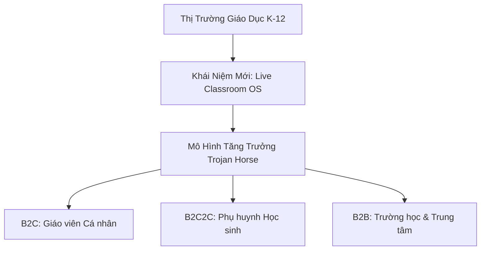
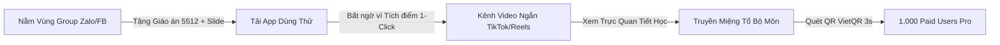

# 📊 TÀI LIỆU CHIẾN LƯỢC KINH DOANH & PHÂN PHỐI (BUSINESS & GTM STRATEGY)
> **Dự án:** **LênLớp** / **Avina Class** (*Live Class Workspace / Teaching OS*)  
> **Mục tiêu Doanh thu Target:** **$1,000,000 – $3,000,000 ARR** (~25 – 75 Tỷ VNĐ/năm)  
> **Mô hình Vận hành:** Lean / Bootstrapped SaaS (Dòng tiền dương, Lợi nhuận ròng 40% – 60%)

---

## 1. LUẬN ĐIỂM ĐẦU TƯ & ĐỊNH VỊ THỊ TRƯỜNG (INVESTMENT THESIS)



### 1.1. Quy Mô Thị Trường (Market Size & Sweet Spot)
- **Thị trường Việt Nam (TAM):** Hơn 1.2 triệu giáo viên phổ thông (K-12).
- **Điểm ngọt (Sweet Spot) ở mốc $1M – $3M ARR:**
  - Không cần gọi vốn mạo hiểm (Venture Capital) đốt tiền quảng cáo hay ép tăng trưởng nóng ra toàn cầu.
  - Chỉ cần chinh phục **15,000 – 25,000 Giáo viên trả phí** (chỉ chiếm ~2% tổng số giáo viên cả nước).
  - Vận hành với bộ máy tinh gọn (5 – 12 nhân sự chuyên về Product/Dev), lợi nhuận ròng bỏ túi Founder có thể đạt **15 – 40 Tỷ VNĐ/năm**.

### 1.2. Chiến Lược "Con Ngựa Gỗ Trojan" (Trojan Horse Strategy)
1. **Gieo mầm B2C (Giáo viên):** Dùng tính năng *Trợ lý Tiết học 1-Click + Tích điểm 1-Touch + AI Replay 60s* giá "trà đá" để phủ rộng nhanh trong từng trường học.
2. **Kích hoạt B2C2C (Phụ huynh):** Báo cáo tiết học tuần gửi qua Zalo thu hút Phụ huynh trả phí để xem phân tích AI chuyên sâu.
3. **Thâu tóm B2B (Trường học):** Khi 40-50% giáo viên trong một trường dùng app, tiếp cận Ban Giám Hiệu bán bản *School Enterprise Dashboard* để quản lý chất lượng giờ dạy toàn trường.

---

## 2. MA TRẬN MÔ HÌNH DOANH THU & CƠ CẤU TARGET $3M ARR

Toàn bộ doanh thu định kỳ hàng năm ($3,000,000 ARR ~ 75 Tỷ VNĐ) được cấu thành từ 4 dòng tiền tự nhiên:

```
                                      ┌─────────────────────────────────────────┐
                                      │   TARGET ARR: $3,000,000 (~75 TỶ VNĐ)   │
                                      └────────────────────┬────────────────────┘
                                                           │
                      ┌────────────────────────────────────┼────────────────────────────────────┐
                      ▼                                    ▼                                    ▼
       【 1. B2C GIÁO VIÊN PRO 】            【 2. B2C2C PARENT PORTAL 】         【 3. B2B SCHOOL ENTERPRISE 】
        20,000 GV x $25/năm                 80,000 PH x $12/năm                  700 Trường x $1,200/năm
        Doanh thu: $500,000 ARR             Doanh thu: $960,000 ARR              Doanh thu: $840,000 ARR
        (~12.5 Tỷ VNĐ)                      (~24 Tỷ VNĐ)                         (~21 Tỷ VNĐ)
```

*(Dòng tiền 4: Mở rộng thị trường Đông Nam Á - Thái Lan & Indonesia: 14,000 GV x $50/năm = $700,000 ARR ~ 17.5 Tỷ VNĐ).*

### Chi Tiết Các Gói Sản Phẩm (Monetization Tiers):

| Dòng Tiền | Đối Tượng | Đơn Giá / Gói | Quyền Lợi Nổi Bật | Doanh Thu Dự Kiến |
| :--- | :--- | :--- | :--- | :--- |
| **B2C Free** | Giáo viên | Miễn phí | Trình chiếu Slide, Tích điểm 1-Touch, Vòng quay, Điểm danh. | $0 (Mồi phủ thị trường) |
| **B2C Pro** | Giáo viên | 50k/tháng hoặc 600k/năm ($25/year) | AI Replay bối cảnh 60s, Bóc tách giọng nói, Xuất Excel vnEdu/SMAS 1-Click. | **$500,000 ARR** (20k Users) |
| **B2C2C Parent** | Phụ huynh | 30k/tháng hoặc 300k/năm ($12/year) | Thiệp báo cáo tuần AI, Phân tích điểm mạnh/yếu của con, Bài tập rèn luyện tại nhà. | **$960,000 ARR** (80k Users) |
| **B2B School** | Trường Tư / Trung tâm | 25 - 35 Triệu/năm ($1,200/year) | Dashboard BGH xem chất lượng dạy học Realtime, Đồng bộ thương hiệu trường, API Data. | **$840,000 ARR** (700 Trường) |
| **SEA Scale** | GV Thái/Indo | $50/năm | Bản quốc tế Tiếng Anh / Bản địa hóa. | **$700,000 ARR** (14k Users) |

---

## 3. CHIẾN LƯỢC PHÂN PHỐI GO-TO-MARKET (GTM ROADMAP)

### 🎯 GIAI ĐOẠN 1: ĐẠT 1,000 KHÁCH HÀNG TRẢ PHÍ ĐẦU TIÊN (0 ➔ 1K PAID USERS)
- **Mục tiêu Doanh thu:** 1,000 Giáo viên x 300k - 500k VNĐ/năm = 300 - 500 Triệu VNĐ.
- **Thời gian:** 4 – 6 tháng.
- **Chi phí Marketing:** **~0 VNĐ** (Tận dụng 100% Kênh Hữu cơ & Cộng đồng).



#### 3 Kế Thừa Chiến Thuật Đột Phá:
1. **"Nằm vùng" & "Chữa cháy" trong các Group Chuyên môn:**
   - *Cách làm:* Đăng bài chia sẻ tài nguyên giá trị: *"Tặng thầy cô File Kế hoạch bài dạy 5512 mẫu Môn Ngữ văn 10 + Bộ Slide trình chiếu tích hợp Thanh Tích Điểm 1-Click & Vòng quay dùng thử miễn phí"*.
   - *Hiệu quả:* Giáo viên mở file bài giảng trong ứng dụng ➔ Thấy thanh công cụ tích điểm & vinh danh quá tiện lợi ➔ Chuyển đổi thành người dùng.
2. **Kênh Video Ngắn TikTok / Facebook Reels (Show, Don't Tell):**
   - *Kịch bản 30s quay thực tế:* Giáo viên đứng giảng trên bục giảng, tay cầm điện thoại quẹt nhẹ ➔ Tivi bùng nổ hiệu ứng vinh danh ngôi sao + âm thanh "Ting ting" ➔ Học sinh ồ lên thích thú.
   - *Caption:* *"Cách tôi giữ học sinh tập trung 100% trong tiết Văn mà không cần đập bàn gọi tên."* (Tỷ lệ Viral cực cao vì giải quyết đúng nỗi đau mất trật tự).
3. **Chương Trình Đồng Nghiệp Giới Thiệu (Teacher Referral Engine):**
   - *"Giới thiệu 1 đồng nghiệp trong tổ bộ môn cài app ➔ Cả 2 cùng nhận 1 tháng dùng gói AI Replay Bối Cảnh Miễn Phí"*.

---

### 🎯 GIAI ĐOẠN 2: BÁNH ĐÀ TĂNG TRƯỞNG SCALE-UP (1K ➔ 50K USERS)
1. **Kích hoạt Dòng tiền Phụ huynh (B2C2C Flywheel):**
   - Giáo viên chốt tiết/cuối tuần ➔ App tự tạo "Thiệp báo cáo nề nếp AI" gửi qua Zalo cho Phụ huynh.
   - Phụ huynh xem bản tóm tắt cơ bản (Free); nâng cấp gói *Parent Care* (30k/tháng) để xem phân tích AI chuyên sâu.
   - *Tỷ lệ chuyển đổi:* 30,000 GV active x 40 học sinh = 1.2 triệu Phụ huynh tiếp cận ➔ Chỉ cần 7-8% Phụ huynh trả phí = **$1.2M ARR**.
2. **Sales B2B Đánh Vào Trường Tư & Trung Tâm Anh Ngữ:**
   - Tiếp cận Ban Giám Hiệu với thông điệp: *"Giúp BGH theo dõi Chuẩn Chất lượng Giảng dạy (Teaching Quality Dashboard) của toàn bộ giáo viên theo thời gian thực mà không cần dự giờ đột xuất."*
   - Chốt các hợp đồng 20 – 40 triệu VNĐ/trường/năm.

---

## 4. PHÂN TÍCH TÊN THƯƠNG HIỆU & HÀNH VI TÂM LÝ GIÁO VIÊN

### Giải Mã Hành Vi Tiếp Cận Của Giáo Viên Việt Nam (Teacher Persona):
- **Độ tuổi:** Gần 50% giáo viên công lập thuộc độ tuổi trung niên (35 – 50 tuổi).
- **Rào cản tiếng Anh:** Rất ngại gõ hoặc đọc các tên tiếng Anh phức tạp như *ClassFlow, TeachUp, Presenter*. Giáo viên dễ đọc sai thành *"Cờ-lát-flo"* hoặc gõ sai chính tả (*clasflo*) ➔ Không tìm thấy app trên Google/App Store.
- **Tâm lý chi trả:** Sẵn sàng bỏ tiền túi mua công cụ hỗ trợ nếu dưới 50k/tháng ("giá trà đá"). Thanh toán bằng VietQR chuyển khoản ngân hàng trong 3 giây.

### Bảng So Sánh Chiến Lược Đặt Tên:

| Tên Ứng Dụng | Phát Âm & Gõ | Mức Độ Thiện Cảm | Khuyến Nghị Sử Dụng |
| :--- | :--- | :--- | :--- |
| 🏆 **LênLớp** / **Lên Lớp 360** | 100% Gõ đúng (`lenlop`), đọc quen thuộc hàng ngày. | Cực kỳ gần gũi, dâng trào cảm xúc nghề nghiệp (*"Mở App là Lên Lớp"*). | **KHUYÊN DÙNG NHẤT** cho chiến lược B2C phủ rộng nhanh toàn quốc. |
| 🥈 **Avina Class** | Đọc A-Vi-Na chuẩn tiếng Việt 100%, gõ mượt. | Nghe chính thống, tin tưởng, sang trọng. | **KHUYÊN DÙNG** nếu muốn vừa làm B2C vừa dễ bán gói Enterprise B2B cho BGH. |
| 🥉 **ClassFlow** | Dễ gõ sai (`clasflo`), đọc ngập ngừng với giáo viên lớn tuổi. | Hiện đại, chuẩn quốc tế. | Phù hợp khi đánh thị trường Đông Nam Á / Global. |

---

## 5. CHIẾN LƯỢC PHÁP LÝ, THUẾ & VẬN HÀNH THEO LUẬT VIỆT NAM

Founder nên đi theo lộ trình 3 giai đoạn để tối ưu chi phí và tận dụng tối đa ưu đãi thuế của Nhà nước:

```
 [ GIAI ĐOẠN 1: MVP / Launch ]        [ GIAI ĐOẠN 2: Product-Market Fit ]     [ GIAI ĐOẠN 3: Scale B2B ]
 Doanh thu: < 30 triệu/tháng          Doanh thu: 30 - 100 triệu/tháng         Doanh thu: > 100 triệu/tháng
 ─────────────────────────────        ───────────────────────────────────     ─────────────────────────────
 • Dùng TÀI KHOẢN CÁ NHÂN              • THÀNH LẬP CÔNG TY TNHH 1 THÀNH VIÊN   • MỞ RỘNG B2B & ƯU ĐÃI THUẾ
 • Tích hợp PayOS/Sepay               • Mở tài khoản doanh nghiệp             • Xuất Hóa đơn VAT cho Trường
 • Tập trung B2C Giáo viên            • Đăng ký xuất Hóa đơn Điện tử          • Hưởng ưu đãi Thuế Phần mềm
```

### 5.1. Giai Đoạn 1: Dùng Tài Khoản Cá Nhân + Cổng Sepay/PayOS (Test Nhanh)
- **Tính hợp pháp:** Cá nhân kinh doanh phần mềm kê khai nộp thuế TNCN/GTGT khi doanh thu > 100 triệu VNĐ/năm.
- **Cách thu tiền:** Tích hợp Sepay hoặc PayOS tự động nhận chuyển khoản VietQR cá nhân, tự động kích hoạt tài khoản Pro trong 3 giây.
- **Ưu điểm:** Zero chi phí vận hành bộ máy kế toán công ty.

### 5.2. Giai Đoạn 2: Thành Lập Công Ty TNHH 1 Thành Viên (Khi Có Dòng Tiền Đều)
- Thành lập khi xuất hiện khách hàng B2B (Trường học/Trung tâm) đòi hỏi xuất **Hóa đơn Điện tử (VAT)** để hạch toán chi phí.
- **Đăng ký ngành nghề chuẩn:** Lập trình máy vi tính (`6201`), Xuất bản phần mềm (`5820`).
- Chi phí kế toán thuế độc lập chỉ khoảng 500k – 1.5 triệu VNĐ/tháng.

### 5.3. Bí Quyết Tận Dụng "Ưu Đãi Thuế Phần Mềm" Tại Việt Nam:
Theo quy định hiện hành đối với Doanh nghiệp Sản xuất & Cung cấp Dịch vụ Phần mềm (SaaS):
1. **Thuế GTGT (VAT) = 0% / Không chịu thuế:** Dịch vụ phần mềm bán tại Việt Nam thuộc đối tượng không chịu thuế GTGT. Thu 500,000 VNĐ là doanh thu thực nhận 500,000 VNĐ, không phải cộng 8% hay 10% VAT.
2. **Ưu đãi Thuế TNDN (Thuế Thu Nhập Doanh Nghiệp):**
   - Áp dụng Thuế suất ưu đãi **10% trong 15 năm** (thay vì mức chuẩn 20%).
   - **Miễn 100% Thuế TNDN trong 4 năm đầu** (kể từ khi có thu nhập chịu thuế).
   - **Giảm 50% số thuế phải nộp trong 9 năm tiếp theo**.

---

## 6. MA TRẬN QUẢN TRỊ RỦI RO & KẾ HOẠCH HÀNH ĐỘNG CHO FOUNDER

### 6.1. Ma Trận Quản Trị Rủi Ro (Risk Matrix)

| Rủi Ro | Mức Độ | Giải Pháp Khắc Phục Cốt Lõi |
| :--- | :---: | :--- |
| **1. Chi phí Server/Storage nổ tung** | 🔴 Rất cao | Áp dụng Local-First: Slide/Video nằm ở máy giáo viên. Cloud chỉ lưu dữ liệu JSON nhẹ ➔ Chi phí Server tiệm cận 0 VNĐ. |
| **2. Wifi trường học chập chờn** | 🔴 Rất cao | Zero-Latency Offline Mode: Trình chiếu, tích điểm, điểm danh chạy offline 100%. Mạng có lại tự âm thầm Sync ngầm. |
| **3. Bị các "Ông lớn" (vnEdu, Viettel) copy** | 🟡 Trung bình | Đô hộ về mặt Trải nghiệm (UX Moat): Các phần mềm hành chính cồng kềnh khó thay đổi DNA thiết kế. Tốc độ cải tiến sản phẩm & tính năng AI Replay bối cảnh sẽ giữ chân user. |
| **4. Bảo mật dữ liệu học sinh** | 🔴 Rất cao | Không lưu ảnh/khuôn mặt nhạy cảm. Dữ liệu giọng nói bóc tách qua AI phải được mã hóa và xóa file audio gốc ngay sau khi giáo viên Confirm. |

---

### 6.2. Kế Hoạch Hành Động Cho Founder (Founder Action Plan)

```
[Tuần 1 - 2] ──────────► [Tuần 3 - 8] ──────────► [Tuần 9 - 12] ──────────► [Tuần 13 - 16]
 Đóng gói MVP            Chạy Seed 50 GV          Quay Video Reels         Kích hoạt VietQR
 "Trợ lý 1-Click"        dạy thử Môn Văn          TikTok Viral             Thu phí Pro 10k-50k
```

1. **Đóng gói bản MVP "Sắc như dao cạo":** Tập trung 3 tính năng: *Lesson Capsule (Import PPT) + Thanh Tích điểm 1-Touch trên Presenter View + Bảng Chốt Tiết 60s*.
2. **Chọn Sandbox thử nghiệm:** Thử nghiệm trực tiếp trên môn **Ngữ Văn & Lịch Sử THCS/THPT** (nơi giáo viên cần giữ mạch giảng thăng hoa nhất).
3. **Đo lường chỉ số "Độ dính" (Retention Rate):** Đảm bảo **>80% giáo viên** sau khi dùng thử 3 tiết học đầu tiên sẽ *bắt buộc phải mở app ở tất cả các tiết học sau*.

---

> 📌 **Kết Luận:**  
> Dự án **LênLớp / Avina Class** sở hữu một mô hình kinh doanh **cực kỳ lành mạnh, thực tế và biên lợi nhuận cao** tại Việt Nam. Bằng việc kết hợp giữa **Trải nghiệm sản phẩm xuất sắc (PLG)** và **Chiến lược phân phối bình dân**, Founder hoàn toàn có thể làm chủ một "cỗ máy in tiền tự động" đạt mốc **$1M – $3M ARR** mà không cần đốt tiền quảng cáo hay áp lực từ các quỹ đầu tư mạo hiểm!
