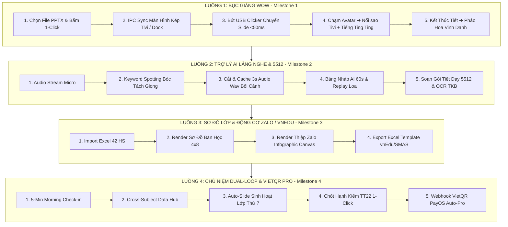

# 🏗️ TÀI LIỆU KIẾN TRÚC CORE KỸ THUẬT & QUY TRÌNH CẮT DỌC LUỒNG TÍNH NĂNG (CORE SYSTEM ARCHITECTURE & VERTICAL SLICE SPECIFICATION)

> **Dành cho:** Senior Developers, Tech Leads & Software Architects  
> **Nguyên tắc cốt lõi:**  
> 1. **Cắt dọc luồng tính năng (Vertical Slicing):** Hoàn thành trọn vẹn từng luồng người dùng End-to-End từ UI ➔ State ➔ Storage ➔ Event, tuyệt đối KHÔNG làm dở dang theo chiều ngang gây tắc nghẽn (Blocker dependency).  
> 2. **Kiến trúc Core tối ưu:** Xây dựng phần Lõi hệ thống (Core Engine) cực kỳ vững chắc, đáp ứng hiệu năng cao, chạy Offline Local-First và sẵn sàng mở rộng module.

---

## 1. MÔ HÌNH CẮT DỌC LUỒNG TÍNH NĂNG (VERTICAL SLICE STRATEGY)

Để đảm bảo mỗi Milestone hoàn thành là một phiên bản **chạy được, test được và mang lại giá trị sử dụng ngay**, dự án chia thành 4 Luồng Tính Năng Độc Lập (Vertical Threads):



### Quy Tắc Thực Thi Tối Thượng Cho Đội Ngũ Dev:
- **Nguyên tắc Khép kín:** Đã làm Luồng 1 (Bục giảng WOW) là phải chạy hoàn chỉnh từ chọn slide đến pháo hoa vinh danh. Không dừng lại ở việc "mới làm xong giao diện mà chưa nối event".
- **Không phục thuộc tính năng sau:** Luồng 1 hoàn toàn KHÔNG cần chờ AI của Luồng 2 hay Excel của Luồng 3. Dev có thể test độc lập và đóng gói bản Release M1.

---

## 2. BẢN THIẾT KẾ KIẾN TRÚC CORE DÀNH CHO SENIOR DEV (CORE SYSTEM BLUEPRINT)

```
┌────────────────────────────────────────────────────────────────────────────────────────┐
│                                 CORE ARCHITECTURE SYSTEM                               │
├────────────────────────────────────────────────────────────────────────────────────────┤
│                                                                                        │
│   ┌────────────────────────────────────────────────────────────────────────────────┐   │
│   │ 1. PRESENTATION LAYER (React / Custom Web Components / Modern CSS Modules)     │   │
│   └───────────────────────┬────────────────────────────────┬───────────────────────┘   │
│                           │                                │                           │
│   ┌───────────────────────▼────────────────────────────────▼───────────────────────┐   │
│   │ 2. CORE STATE & EVENT BUS (Reactive Store + Dual-Screen IPC Dispatcher)        │   │
│   └───────────────────────┬────────────────────────────────┬───────────────────────┘   │
│                           │                                │                           │
│   ┌───────────────────────▼────────────────────────────────▼───────────────────────┐   │
│   │ 3. CORE SERVICE ADAPTERS                                                       │   │
│   │  • SlideEngineAdapter (PPTX/PDF Canvas Renderer)                               │   │
│   │  • AudioAiProcessor (STT Keyword Trigger + 3s Audio Wav Buffer)                │   │
│   │  • ZaloCanvasGenerator (Infographic Image Render)                              │   │
│   │  • MinistryExportAdapter (vnEdu / SMAS / eNetViet Template Engine)             │   │
│   └───────────────────────┬────────────────────────────────┬───────────────────────┘   │
│                           │                                │                           │
│   ┌───────────────────────▼────────────────────────────────▼───────────────────────┐   │
│   │ 4. LOCAL-FIRST STORAGE ADAPTER (SQLite / IndexedDB + Sync Queue)               │   │
│   └────────────────────────────────────────────────────────────────────────────────┘   │
│                                                                                        │
└────────────────────────────────────────────────────────────────────────────────────────┘
```

---

### 2.1. Cụm Core 1: Core State & Event Bus (`CoreStore` & `IPCDispatcher`)
- **Triết lý:** Quản lý State tập trung theo mô hình **Unidirectional Data Flow (Luồng dữ liệu đơn hướng)** kết hợp **Reactive Pub/Sub**.
- **Mục tiêu Kỹ thuật:**
  - Mutation state cực nhanh trong `< 2ms`.
  - Đồng bộ trạng thái 2 màn hình (Tivi Presenter & Teacher Dock PC) qua IPC (Electron/Tauri) với độ trễ `< 10ms`.

```typescript
// CORE STATE CONTROLLER INTERFACE
export interface ICoreState {
  currentView: string;
  activeLesson: LessonCapsule | null;
  currentSlideIndex: number;
  students: Student[];
  aiLogs: AudioAiDraftLog[];
  soundEnabled: boolean;
}

export class CoreStore {
  private state: ICoreState;
  private listeners: Set<(state: ICoreState) => void>;

  constructor(initialState: ICoreState) {
    this.state = initialState;
    this.listeners = new Set();
  }

  public getState(): ICoreState {
    return Object.freeze({ ...this.state });
  }

  public dispatch(action: CoreAction): void {
    const nextState = coreReducer(this.state, action);
    this.state = nextState;
    this.notify();
  }

  private notify(): void {
    this.listeners.forEach(fn => fn(this.state));
  }
}
```

---

### 2.2. Cụm Core 2: Bộ Đọc Bài Giảng & Slide Engine Adapter (`SlideEngineAdapter`)
- **Triết lý:** Không phụ thuộc vào ứng dụng PowerPoint cài trên máy. Ứng dụng tự nhúng **Bộ Render Slide Độc Lập**.
- **Giải pháp Kỹ thuật cho Senior Dev:**
  - Hỗ trợ định dạng `.pptx`, `.pdf`, `.mp4`.
  - Chuyển đổi Slide PPTX thành các khung ảnh Canvas sắc nét chất lượng 4K.
  - Pre-render Slide tiếp theo (`slideIndex + 1`) vào bộ đệm RAM để khi bấm Bút trình chiếu USB, Slide chuyển lập tức không bị giật lag khung hình (Zero Frame Drop).

---

### 2.3. Cụm Core 3: Bộ Xử Lý Âm Thanh & AI Keyword Trigger (`AudioAiProcessor`)
- **Triết lý:** Thu âm liên tục nhưng **chỉ lưu bộ đệm Ring Buffer 3 giây**. Khi phát hiện Từ Khoá Sư Phạm mới xuất ra file WAV.
- **Tối ưu Kỹ thuật:**
  - Sử dụng `AudioWorkletNode` để xử lý âm thanh ở Worker Thread riêng, tuyệt đối KHÔNG làm giật lag UI Thread chính.
  - Giải phóng bộ nhớ RAM liên tục, đảm bảo ứng dụng chạy 8 tiếng liên tục không bị tràn bộ nhớ (Memory Leak Free).

```typescript
// AUDIO RING BUFFER PROCESSOR (3-SECOND WINDOW)
export class AudioRingBuffer {
  private buffer: Float32Array;
  private sampleRate: number;
  private writeIndex: number = 0;

  constructor(seconds: number = 3, sampleRate: number = 16000) {
    this.sampleRate = sampleRate;
    this.buffer = new Float32Array(seconds * sampleRate);
  }

  public write(data: Float32Array): void {
    for (let i = 0; i < data.length; i++) {
      this.buffer[this.writeIndex] = data[i];
      this.writeIndex = (this.writeIndex + 1) % this.buffer.length;
    }
  }

  public extract3SecondWav(): Blob {
    // Trích xuất chính xác 3 giây âm thanh vừa diễn ra
    return createWavBlob(this.buffer, this.sampleRate);
  }
}
```

---

### 2.4. Cụm Core 4: Hạ Tầng Lưu Trữ Local-First (`LocalFirstStorageAdapter`)
- **Triết lý:** **Offline là trạng thái mặc định (Offline-First)**. Mọi thao tác lưu dữ liệu đều ghi vào SQLite / IndexedDB tại máy local trước.
- **Tối ưu Kỹ thuật:**
  - Sử dụng Write-Ahead Logging (WAL) cho SQLite.
  - Hàng chờ đồng bộ ngầm (Background Sync Queue): Khi có mạng, Worker tự động đẩy JSON log lên Cloud.

---

## 3. BẢNG PHÂN CHIA NHIỆM VỤ THỰC THI CHO ĐỘI NGŨ SENIOR DEV

| Module Core | Nhiệm Vụ Kỹ Thuật Senior Dev | Luồng Cắt Dọc Đảm Bảo |
| :--- | :--- | :--- |
| **Core 1: State & IPC** | Lập trình `CoreStore` Pub/Sub & `IPCDispatcher` kết nối 2 màn hình Tivi/PC | **Luồng 1 (Bục Giảng WOW)** |
| **Core 2: Slide Engine** | Lập trình `SlideEngineAdapter` đọc PPTX/PDF và Pre-render buffer RAM | **Luồng 1 (Bục Giảng WOW)** |
| **Core 3: Web Audio** | Lập trình `AudioSynthesizer` phát tiếng "Ting ting" & Particle Toast Overlay | **Luồng 1 (Bục Giảng WOW)** |
| **Core 4: Audio AI** | Lập trình `AudioWorklet` Ring Buffer 3s & Keyword Spotting Trigger | **Luồng 2 (AI Silent Companion)** |
| **Core 5: Data Adapter** | Lập trình `LocalFirstStorageAdapter` (SQLite/IndexedDB + WAL Sync) | **Luồng 3 (Excel & Sơ Đồ Lớp)** |
| **Core 6: Export Engine** | Lập trình `MinistryExportAdapter` (Xuất file Excel đúng template vnEdu/SMAS) | **Luồng 3 & 4 (Xuất Báo Cáo)** |

---

> 📌 **Tóm tắt cho Đội ngũ Senior Dev:**  
> 1. Xây dựng chắc chắn 4 Cụm Core Architecture trước.  
> 2. Thực thi dứt điểm từng **Vertical Thread** (Luồng 1 ➔ Luồng 2 ➔ Luồng 3 ➔ Luồng 4).  
> 3. Mỗi Luồng hoàn thành phải chạy độc lập được 100%, test mượt mà mới chuyển sang Luồng tiếp theo!
