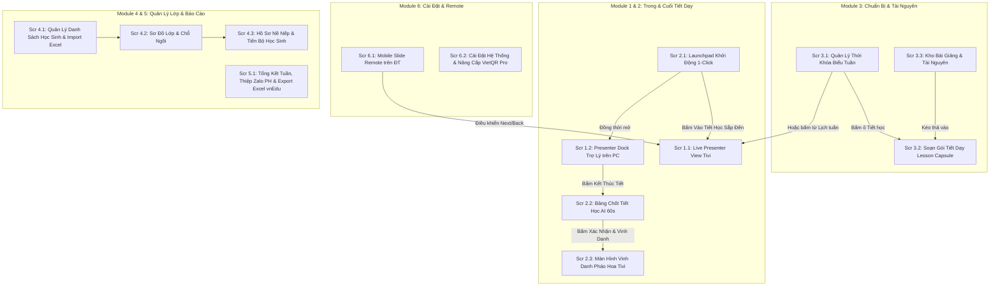
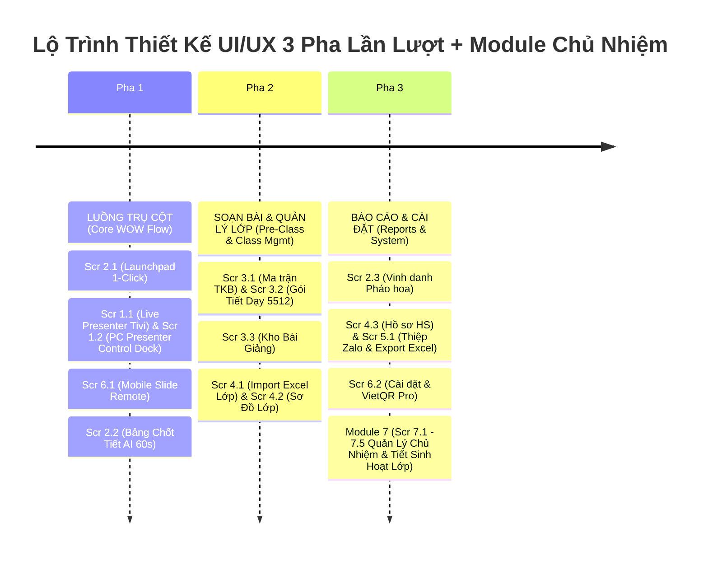

# 🎨 THIẾT KẾ UI/UX: DANH SÁCH MÀN HÌNH & LUỒNG TRẢI NGHIỆM (UI/UX SPECIFICATION)
> **Dự án:** **LênLớp** / **Avina Class** (*Live Class Workspace / Teaching OS*)  
> **Mục tiêu:** Định hình toàn bộ luồng tương tác visual trước khi lập trình, giúp thấy ngay bức tranh sản phẩm.  
> **Tổng số màn hình hoàn chỉnh:** **13 Màn hình chính** (gói gọn trong **6 Module chức năng**).

---

## 🗺️ TỔNG QUAN LUỒNG CHUYỂN MÀN HÌNH (USER FLOW MAP)



---

## 📦 CHI TIẾT 6 MODULE & 13 MÀN HÌNH HOÀN CHỈNH

### ─────────────── MODULE 1: TRÌNH CHIẾU & TRỢ LÝ TRONG LỚP (LIVE CLASS WORKSPACE) ───────────────

#### 🖥️ Màn Hình 1.1: Live Presenter View (Hiển thị trên Tivi / Máy chiếu cho học sinh)
- **Mục đích:** Màn hình chính chiếu cho cả lớp nhìn, cực kỳ đẹp mắt, font chữ to rõ (nhìn từ xa 5-7m).
- **Thành phần UI:**
  - Khu vực chính trung tâm: Trình chiếu Slide PPTX/PDF/Video MP4.
  - Floating Toast Notification (Góc trên phải): Hiệu ứng hạt sáng bay lên + Tiếng "Ting ting" khi được cộng điểm (`"+1 ⭐ Em An - Tự tin diễn đạt!"`).
  - Overlay Widget Modals (Xuất hiện khi giáo viên gọi):
    - *Vòng quay may mắn (Random Wheel):* Bánh xe xoay tên học sinh.
    - *Đồng hồ đếm ngược (Countdown Timer):* Số to đếm 3:00 phút làm bài nhóm.

#### 🎛️ Màn Hình 1.2: Presenter Control Bar & Side Dock (Thanh Trợ Lý trên PC/Laptop giáo viên)
- **Mục đích:** Màn hình điều khiển riêng tư của giáo viên (Tivi không thấy).
- **Thành phần UI:**
  - **Top Bar:** Tên lớp & tiết dạy (*"Thứ 3 - Tiết 2: Ngữ văn 10A2"*), Đồng hồ đếm thời lượng tiết, Chỉ số Slide (`5/20`), Nút đỏ nổi bật `[Kết thúc Tiết học]`.
  - **Side Dock (Thanh công cụ bên hông):**
    - ✋ *Điểm danh quick-view:* Danh sách học sinh vắng/muộn.
    - ⭐ *Tích điểm 1-Click:* Grid danh sách học sinh theo bàn, click icon ⭐ để cộng điểm.
    - 🎡 *Tool Launcher:* Nút bật nhanh Vòng quay, Đồng hồ đếm giờ, Chuông báo.

---

### ─────────────── MODULE 2: KHỞI ĐỘNG, CHỐT TIẾT 60S & VINH DANH (POST-CLASS & LAUNCHPAD) ───────────────

#### 🚀 Màn Hình 2.1: Instant Launchpad (Màn hình Khởi động 1-Click - Trang Chủ)
- **Mục đích:** Màn hình thông minh giáo viên thấy ngay khi mở App tại phòng học.
- **Thành phần UI:**
  - **Widget Thời Gian Thực & Lịch Hôm Nay:** Tự động phát hiện giờ hệ thống.
  - **Hero Card - Tiết Học Sắp Đến Giờ:** Tự động làm nổi bật tiết học đang/sắp diễn ra trong 5-10 phút (*"Thứ 3, Tiết 2 - Môn Ngữ Văn - Lớp 10A2 (Đang diễn ra)"*).
  - **Nút Bấm Khổng Lồ (Giant CTA):** **`[🚀 BẮT ĐẦU DẠY TIẾT HỌC 1-CLICK]`** (vào thẳng đúng tiết sắp đến giờ).
  - **Mục Các Tiết Học Tiếp Theo Trong Ngày:** Danh sách các tiết học còn lại của buổi dạy.
  - **Lối Tắt Xem Thời Khóa Biểu Tuần:** Nút chuyển sang xem Ma trận Thời khóa biểu tổng quan để bấm chọn từng tiết học cụ thể.

#### 🤖 Màn Hình 2.2: Post-Class AI Confirmation Board (Bảng Chốt Tiết Học 60s - Review & Replay)
- **Mục đích:** Giao diện xem lại và duyệt nháp nhận xét AI thu thập trong giờ (chỉ riêng giáo viên thấy).
- **Thành phần UI:**
  - Danh sách dạng Card nhận xét AI đề xuất:
    - *Thẻ 1:* `[18:25 - Slide 5]` Em An ➔ đề xuất +2 Star (Diễn đạt trôi chảy).
    - Nút nghe lại Audio snippet 3s: **`[🔊 Play 3s]`** (Loa ĐT/PC phát lại giọng giáo viên lúc đó).
    - Dropdown đổi tên nhanh: `[An ▾]` (Gợi ý: Anh, Ánh).
    - Bộ đếm Sao & Huy hiệu: Gán thêm huy hiệu Sáng tạo, Tốt bụng...
  - Nút hành động chính: **`[✔ XÁC NHẬN & VINH DANH]`** (Màu xanh lá) & **`[✖ Hủy tất cả]`**.

#### 🎆 Màn Hình 2.3: Celebration & Lesson Recap View (Màn hình Vinh Danh trên Tivi)
- **Mục đích:** Màn hình bùng nổ 3 phút cuối giờ trên Tivi tạo cảm xúc hào hứng cho học sinh.
- **Thành phần UI:**
  - Hiệu ứng hoạt hình pháo hoa rực rỡ.
  - Card vinh danh Top 3 Ngôi Sao Tiết Học (Avatar quái vật/nhân vật + Tên học sinh).
  - Bảng tổng kết đóng góp của toàn lớp.

---

### ─────────────── MODULE 3: CHUẨN BỊ BÀI DẠY & KHO TÀI NGUYÊN (PRE-CLASS & RESOURCES) ───────────────

#### 📅 Màn Hình 3.1: Weekly Timetable Manager (Quản lý & Nhập Thời Khóa Biểu Tuần)
- **Mục đích:** Giúp giáo viên thiết lập, chỉnh sửa và quản lý lịch dạy hàng tuần một cách trực quan.
- **Thành phần UI:**
  - **Ma Trận Lịch Tuần (Grid 6 Ngày x 10 Tiết):** Chia Sáng (Tiết 1-5) & Chiều (Tiết 6-10). Mỗi ô có màu sắc phân biệt theo Lớp/Môn.
  - **Bộ Công Cụ Nhập Lịch Nhanh:** Nút `[📥 Import Excel TKB]` và `[📷 Quét Ảnh TKB bằng AI]`.
  - **Drawer Chỉnh Sửa Ô Tiết Học:** Chọn Lớp, Môn, Phòng học, Thời gian.

#### 📂 Màn Hình 3.2: Lesson Capsule Editor (Tạo & Quản lý Gói Tiết Dạy)
- **Mục đích:** Soạn bài và đính kèm tài liệu cho từng tiết học cụ thể.
- **Thành phần UI:**
  - Selector chọn Lớp, Môn học, Tiết từ Thời khóa biểu.
  - Khung upload kéo-thả (Drag & Drop Zone): File PPTX, PDF, MP4, Link Quizizz/Canva.
  - Tab Trình soạn Kế hoạch 5512 (4 hoạt động). Tình trạng lưu Offline `[✔ Đã tải Offline]`.

#### 📚 Màn Hình 3.3: Content Library & Resource Bank (Kho Bài Giảng & Ngân Hàng Tài Nguyên)
- **Mục đích:** Lưu trữ, phân loại và tái sử dụng các Slide, Đề thi, Giáo án qua nhiều năm học.
- **Thành phần UI:**
  - Bộ thư mục phân loại theo Môn học, Khối lớp (VD: *Thư mục Slide Văn 10*, *Kho Game Kahoot*).
  - Tìm kiếm & Lọc nhanh theo Từ khóa.
  - Nút gán nhanh tài nguyên vào Thời khóa biểu tuần.

---

### ─────────────── MODULE 4: QUẢN LÝ LỚP HỌC & HỌC SINH (CLASS & STUDENT MANAGEMENT) ───────────────

#### 📋 Màn Hình 4.1: Class & Student Roster Manager (Quản lý Danh Sách Học Sinh & Lớp Học)
- **Mục đích:** Thêm mới/chỉnh sửa danh sách lớp học và danh sách học sinh.
- **Thành phần UI:**
  - Danh sách các Lớp giảng dạy (*Lớp 10A2, Lớp 11B1...*).
  - Nút **`[📥 Import Danh Sách Lớp Từ Excel]`** (Upload file danh sách học sinh do nhà trường cấp).
  - Bảng danh sách học sinh: Họ tên, Mã HS, Ngày sinh, Tên Phụ huynh, SĐT Zalo.

#### 🪑 Màn Hình 4.2: Seating Chart Manager (Quản lý Sơ Đồ Lớp & Chỗ Ngồi)
- **Mục đích:** Xây dựng sơ đồ chỗ ngồi thực tế trong phòng học.
- **Thành phần UI:**
  - Lưới sơ đồ chỗ ngồi (Grid 4 dãy x 8 bàn).
  - Kéo-thả học sinh vào đúng vị trí bàn học.
  - Hiển thị điểm nề nếp tích lũy ngay trên vị trí bàn.

#### 👤 Màn Hình 4.3: Student Progress & History Detail (Hồ Sơ Nề Nếp & Lịch Sử Học Sinh)
- **Mục đích:** Xem chi tiết lộ trình tiến bộ, lịch sử nhận xét và huy hiệu của 1 học sinh cá nhân.
- **Thành phần UI:**
  - Card thông tin cá nhân & Tổng số sao/huy hiệu đạt được.
  - Biểu đồ biến thiên nề nếp/thái độ qua các tuần.
  - Nhật ký nhật xét chi tiết từng tiết học (ngày giờ, tiêu chí khen thưởng).

---

### ─────────────── MODULE 5: BÁO CÁO & XUẤT DỮ LIỆU (PERIODIC REPORTS & EXPORT) ───────────────

#### 📊 Màn Hình 5.1: Weekly Summary, Parent Card & Export Engine (Tổng Kết Tuần & Xuất Báo Cáo)
- **Mục đích:** Tổng kết thi đua tuần, gửi thông báo Phụ huynh và xuất file cho BGH.
- **Thành phần UI:**
  - Bảng xếp hạng thi đua tuần giữa các Tổ / Học sinh.
  - **Bộ Tạo Thiệp Zalo Phụ Huynh:** Tạo thiệp Infographic đẹp mắt gửi Zalo cho phụ huynh chỉ với 1-Click.
  - **Modal Export Engine:** Xuất file Excel/CSV chuẩn mẫu vnEdu / eNetViet / SMAS.

---

### ─────────────── MODULE 6: CÀI ĐẶT HỆ THỐNG & MOBILE REMOTE (SYSTEM & COMPANION) ───────────────

#### 📱 Màn Hình 6.1: Mobile Slide Remote (Giao diện Remote 2 Nút trên Điện thoại)
- **Mục đích:** Tay điều khiển chuyển slide tối giản trên điện thoại giáo viên.
- **Thành phần UI:**
  - Giao diện Dark Mode tiết kiệm pin.
  - 2 Nút bấm khổng lồ: **`[◄ SLIDE TRƯỚC]`** và **`[SLIDE TIẾP ►]`**.
  - Bộ đếm trang Slide (`SLIDE 5/20`) & Vùng vuốt cảm ứng (Swipe Canvas).

#### ⚙️ Màn Hình 6.2: Settings & Pro Subscription Manager (Cài Đặt & Nâng Cấp VietQR Pro)
- **Mục đích:** Cấu hình thiết bị âm thanh AI, phím tắt và nâng cấp tài khoản Pro.
- **Thành phần UI:**
  - **Cấu hình Micro & AI:** Chọn Micro thu âm, thử độ nhạy AI lắng nghe giọng nói.
  - **Cấu hình Bút trình chiếu:** Cài đặt phím tắt Next/Back cho bút USB.
  - **Nâng Cấp VietQR Pro:** Mã QR thanh toán tự động kích hoạt bản Pro/AI trong 3 giây.

---

### ─────────────── MODULE 7: QUẢN LÝ CHỦ NIỆM & TIẾT SINH HOẠT LỚP (HOMEROOM MANAGEMENT) ───────────────

#### 🏫 Màn Hình 7.1: Homeroom Hub & Morning Check-in (Trạm Chủ Nhiệm 5 Phút Đầu Giờ)
- **Mục đích:** Giúp GVCN kiểm tra nề nếp lớp chủ nhiệm mỗi sáng trong 30 giây & quản lý tổng hợp đa bộ môn.
- **Thành phần UI:**
  - **Widget Điểm danh 30s AI:** Tự động đồng bộ báo cáo học sinh vắng/nghỉ ốm từ Zalo Phụ huynh.
  - **Bảng Tổng Hợp Đa Bộ Môn (Cross-Subject Data Hub):** Theo dõi sao thưởng & nhắc nhở nề nếp của lớp do tất cả GVBM khác nhập trong tuần.
  - **Quản lý Thu Chi & Sổ Đoàn/Đội:** Theo dõi tiến độ đóng quỹ lớp, bảo hiểm, nhắc việc chủ nhiệm.

#### 🎆 Màn Hình 7.2: 1-Click Homeroom Class Presenter (Trình Chiếu Tiết Sinh Hoạt Lớp Thứ 7 Tự Động)
- **Mục đích:** Biến tiết Sinh hoạt Lớp Thứ 7 thành tiết học vui vẻ, hào hứng, tự động hóa 100%.
- **Thành phần UI:**
  - **Slide Thi Đua Tổ Tự Động:** AI tự sinh slide bảng xếp hạng điểm số giữa các Tổ (Tổ 1, 2, 3) tính từ dữ liệu cả tuần.
  - **Vinh Danh Học Sinh Xuất Sắc & Tiến Bộ:** Chiếu avatar pháo hoa cho Ngôi sao của tuần.
  - **Trình Chiếu Ảnh Hoạt Động Lớp & Nhắc Nhở Tuần Tới:** Giao diện sinh hoạt lớp chuyên nghiệp không cần soạn PPTX thủ công.

#### 📈 Màn Hình 7.3: Homeroom Analytics & Conduct Radar (Bảng Điều Khiển Nề Nếp & Bản Đồ Điểm Nóng)
- **Mục đích:** Phân tích xu hướng nề nếp 42 học sinh, phát hiện sớm các điểm nóng kỷ luật/tâm lý để can thiệp kịp thời.
- **Thành phần UI:**
  - **Biểu đồ Radar 5 Tiêu Chí Rèn Luyện:** Chuyên cần, Kỷ luật, Thái độ, Tương tác nhóm, Học tập.
  - **Thẻ Cảnh Báo AI (Student Risk Alerts):** Nhận diện học sinh sa sút, vắng học không phép hoặc có biểu hiện cần tâm lý học đường.
  - **So Sánh Thi Đua Giữa Các Tổ:** Biểu đồ cột tăng trưởng điểm thưởng ⭐ theo tuần.

#### 💰 Màn Hình 7.4: Class Fund & Zalo Parent Portal (Trung Tâm Thu Chi Quỹ Lớp & Zalo Phụ Huynh)
- **Mục đích:** Minh bạch hóa quỹ lớp, thu tiền quỹ qua VietQR tự động gạch nợ và liên lạc Zalo Phụ huynh 1-Click.
- **Thành phần UI:**
  - **Bảng Thu Chi Quỹ Lớp:** Nhật ký các khoản thu/chi (mua phần thưởng, photo tài liệu, sinh hoạt lớp).
  - **Mã VietQR Thu Quỹ 1-Click:** Phụ huynh quét QR chuyển khoản, hệ thống tự động đánh dấu đã nộp.
  - **Zalo Parent Portal:** Gửi thông báo họp phụ huynh, phiếu khảo sát ý kiến và tin nhắn nhắc nợ quỹ dịu dàng.

#### 🎓 Màn Hình 7.5: Term Conduct Grading & Ministry TT22 Export Engine (Chốt Hạnh Kiểm TT22 & Export vnEdu)
- **Mục đích:** Tự động hóa 100% quy trình đánh giá Rèn luyện / Hạnh kiểm cuối học kỳ chuẩn Thông tư 22/2021/TT-BGDĐT.
- **Thành phần UI:**
  - **Bảng Ma Trận Đánh Giá AI:** Hiển thị mức đề xuất xếp loại (*Tốt / Khá / Đạt / Chưa đạt*) kèm minh chứng cụ thể.
  - **Công Cụ Sửa Đổi 1-Click:** GVCN tùy chỉnh xếp loại, bổ sung nhận xét định tính học bạ.
  - **Động Cơ Đồng Bộ vnEdu / SMAS:** Đẩy 1-Click dữ liệu lên vnEdu hoặc xuất file Excel chuẩn nộp BGH.

---

## 🛠️ LỘ TRÌNH THỰC HIỆN UI/UX CHUẨN PHA LẦN LƯỢT



---

## 📐 QUY CHUẨN THIẾT KẾ SIDEBAR DỌC THU GỌN (COMPACT LEFT SIDEBAR DESIGN SYSTEM)

> 💡 **Mục đích tham chiếu:** Tài liệu này ghi lại toàn bộ quy chuẩn thiết kế (Design Tokens, Bố cục & Trạng thái tương tác) của Thanh Điều Hướng Dọc Thu Gọn Bên Trái (*Compact Left Sidebar*) để làm căn cứ tái lập trình hoặc mở rộng ứng dụng về sau.

```
┌────────────────────────────────────────────────────────────────────────────────────────┐
│                                COMPACT LEFT SIDEBAR LAYOUT                              │
├─────────┬──────────────────────────────────────────────────────────────────────────────┤
│ 🚀 PRO  │  TOP HEADER BAR (Sĩ số, Đồng hồ thời gian thực, Cấu hình Âm thanh, Profile)   │
├─────────┼──────────────────────────────────────────────────────────────────────────────┤
│ PHA 1   │                                                                              │
│ [🚀]    │                                                                              │
│Launchpad│                                                                              │
│ [🖥️]    │                                                                              │
│Presenter│                                                                              │
│         │                                                                              │
│ PHA 2   │                         VÙNG NỘI DUNG CHÍNH SẢN PHẨM                          │
│ [📅]    │                         (Mở rộng tối đa 94% chiều ngang)                     │
│TKB Tuần │                                                                              │
│ [📂]    │                                                                              │
│Gói 5512 │                                                                              │
│         │                                                                              │
│ MODULE7 │                                                                              │
│ [📈]    │                                                                              │
│Điểm Nóng│                                                                              │
└─────────┴──────────────────────────────────────────────────────────────────────────────┘
```

### 1. Triết Lý & Lý Do Chọn Pattern (Design Philosophy):
- **Xu hướng Modern Enterprise OS / SaaS:** Lấy cảm hứng từ giao diện hiện đại của Notion, Linear, Slack, VS Code & Apple macOS.
- **Tối ưu không gian làm việc:** Thu gọn thanh điều hướng cố định bên mép trái với độ rộng nhỏ (`width: 88px`), nhường tới **94% không gian ngang** cho màn hình giảng bài, ma trận thời khóa biểu và bảng dữ liệu học sinh.
- **Khả năng mở rộng không giới hạn (Scalability):** Dễ dàng chứa 20–30 màn hình thuộc 7+ Module mà không bao giờ bị đứt gãy hay tràn ngang.

### 2. Thông Số Kích Thước & Bố Cục (Dimension Tokens):
- **Độ rộng Sidebar (`.app-sidebar`):** `88px` cố định (`position: fixed; top: 0; left: 0; bottom: 0; z-index: 1100`).
- **Khoảng lùi Vùng nội dung (`.app-content-wrapper`):** `margin-left: 88px; width: calc(100% - 88px)`.
- **Thanh cuộn:** Ẩn thanh cuộn mặc định (`scrollbar-width: none`), cuộn ngầm mượt mà khi quá màn hình.

### 3. Quy Chuẩn Ô Nút Điều Hướng (`.nav-tab`):
- **Kích thước Ô bấm:** `width: 74px; padding: 8px 4px; border-radius: 14px (var(--radius-md))`.
- **Bố cục nội dung:** Đặt dọc (`flex-direction: column; align-items: center; text-align: center; gap: 3px`).
- **Icon đại diện (Top):** `font-size: 20px; display: block`.
- **Dòng Chữ Tiêu Đề (Bottom):** `font-size: 10px; font-weight: 600; max-width: 68px; white-space: nowrap; overflow: hidden; text-overflow: ellipsis`.
- **Nhãn Phân Nhóm (`.tab-group-label`):** `font-size: 9px; font-weight: 800; color: var(--accent-blue); letter-spacing: 0.5px; text-transform: uppercase`.

### 4. Trạng Thái Tương Tác (State Interaction Specs):
- **Trạng thái Mặc định (Normal):** `background: transparent; border: 1px solid transparent; color: var(--text-muted)`.
- **Trạng thái Di chuột (Hover):** `background: rgba(255, 255, 255, 0.08); border-color: rgba(255, 255, 255, 0.12); transform: translateY(-2px)`.
- **Trạng thái Đang chọn (Active):** `background: linear-gradient(135deg, rgba(59, 130, 246, 0.3), rgba(37, 99, 235, 0.25)); border-color: var(--accent-blue); color: #fff; font-weight: 700; box-shadow: 0 4px 14px rgba(59, 130, 246, 0.3)`.
- **Tooltip Hỗ Trợ:** Thẻ HTML `title="..."` gắn trên từng nút bấm giúp rê chuột là thấy ngay tên màn hình đầy đủ.

---

> 📌 **Kết luận:**  
> Hệ thống **18 Màn hình (7 Module)** đã bao phủ **100% tất cả các trường hợp sử dụng thực tế** cho cả hai vai trò: **Giáo viên Bộ môn** và **Giáo viên Chủ nhiệm**. Quy chuẩn Sidebar thu gọn 88px được áp dụng đồng bộ toàn hệ thống.
