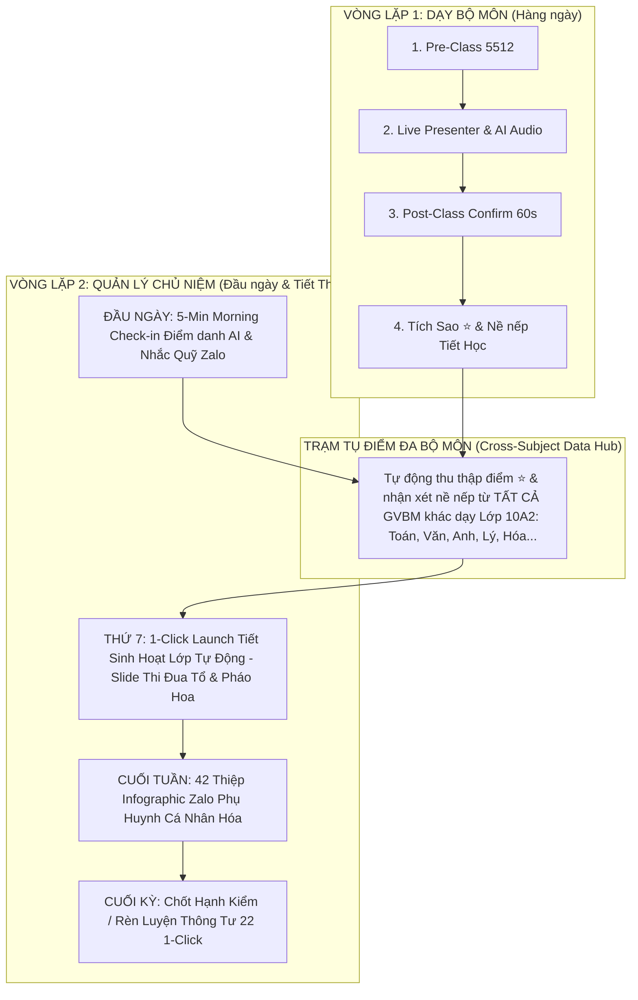

Viewed Mo_Ta_San_Pham.md:1-80
Viewed Mo_Ta_San_Pham.md:120-180
Edited Mo_Ta_San_Pham.md
Viewed Danh_Sach_Man_Hinh_UIUX.md:1-50
Viewed Danh_Sach_Man_Hinh_UIUX.md:140-187
Edited Danh_Sach_Man_Hinh_UIUX.md

Một giáo viên phổ thông Việt Nam thường phải đóng **song song 2 vai trò**: **Giáo viên Bộ môn (GVBM)** và **Giáo viên Chủ nhiệm (GVCN)**.

Nếu phát triển thêm **Module Quản Lý Chủ Nhiệm (Module 7)**, sản phẩm sẽ được nâng cấp từ *Vòng lặp đơn Bộ môn* thành **KIẾN TRÚC VÒNG LẶP KÉP (DUAL-LOOP ARCHITECTURE)**. 

Module Chủ nhiệm không hề tách rời như một app khác, mà nó **nằm ngay ở trạm tụ điểm (Data Hub) trung tâm**, khớp nối 100% vào đúng 4 giai đoạn vận hành khép kín như sau:

---

### 🔄 SƠ ĐỒ KIẾN TRÚC VÒNG LẶP KÉP (DUAL-LOOP ARCHITECTURE):

---

### 4 MẮT XÍCH KHÉP KÍN CỦA MODULE CHỦ NIỆM TRONG SẢN PHẨM:

#### 1️⃣ **ĐẦU NGÀY / 5 PHÚT ĐẦU GIỜ (`Homeroom Morning Check-in` trên Launchpad)**
- **Khép kín:** Ngay khi mở app vào buổi sáng, GVCN không cần mở ứng dụng vnEdu hay nhóm Zalo để đếm từng tin nhắn báo nghỉ.
- **Trợ lý AI báo ngay trên Launchpad:** 
  > *"Sĩ số Lớp chủ nhiệm 10A2 hôm nay: 41/42. Em Dũng xin nghỉ ốm (Mẹ nhắn Zalo lúc 6:45 AM). Đã tự tạo đơn xin phép."*
- **Nhắc việc chủ nhiệm:** Nhắc đóng tiền bảo hiểm, thu sổ đoàn viên, nhắc lịch trực nhật.

#### 2️⃣ **TRONG TUẦN / THU THẬP DỮ LIỆU ĐA BỘ MÔN (`Cross-Subject Data Hub`)**
- **Khép kín:** GVCN không thể có mặt ở tất cả các tiết học của lớp mình. Nhưng thông qua hệ thống **LênLớp**, khi các thầy cô GVBM khác (dạy Toán, Anh, Lý, Hóa...) tích sao ⭐ hoặc ghi nhận vi phạm của học sinh lớp 10A2, toàn bộ dữ liệu tự động chảy ngầm về **Dashboard Chủ Nhiệm của Cô Mai (GVCN)**.
- **Giá trị:** Cô Mai nắm trọn bức tranh nề nếp thời gian thực của lớp mình mà không cần đi hỏi từng GVBM *"Hôm nay lớp tôi thế nào?"*.

#### 3️⃣ **TIẾT SINH HOẠT LỚP THỨ 7 (`1-Click Homeroom Class Presenter` - WOW Moment)**
- **Khép kín:** Đến tiết Sinh hoạt Lớp Thứ 7, thay vì GVCN phải mất 1-2 tiếng tối Thứ 6 để ngồi cộng sổ điểm, làm slide PowerPoint tổng kết thi đua, GVCN chỉ cần bấm **`[🚀 BẮT ĐẦU TIẾT SINH HOẠT LỚP 1-CLICK]`**.
- **AI tự động sinh sẵn Slide Sinh Hoạt Lớp Tích Hợp:**
  - **Slide 1:** Bảng xếp hạng Thi đua **Tổ 1 vs Tổ 2 vs Tổ 3** (tự động cộng tổng sao ⭐ tích lũy từ tất cả các tiết học trong tuần).
  - **Slide 2:** Vinh danh **"Ngôi Sao Học Tập Tuần"** & **"Học Sinh Tiến Bộ Vượt Bậc"** kèm hiệu ứng pháo hoa bùng nổ trên Tivi.
  - **Slide 3:** Chiếu ảnh hoạt động lớp trong tuần & nhắc nhở kế hoạch tuần mới.

#### 4️⃣ **CUỐI TUẦN & CUỐI KỲ (`Zalo Parent Card` & `Chốt Hạnh Kiểm TT22`)**
- **Gửi Báo Báo Phụ Huynh:** Chiều Thứ 7, AI tự động sinh **42 Thiệp Zalo Phụ Huynh Cá Nhân Hóa** chứa điểm nề nếp, sao thưởng và nhận xét tổng hợp của các GVBM ➔ GVCN bấm `[Gửi Đồng Loạt]` trong 30 giây.
- **Chốt Hạnh Kiểm / Rèn Luyện Cuối Kỳ Chuẩn Thông Tư 22:** Cuối học kỳ, AI căn cứ vào lịch sử nề nếp cả học kỳ để tự động đề xuất mức xếp loại (*Tốt / Khá / Đạt / Chưa đạt*) theo quy định Bộ GD&ĐT ➔ GVCN chỉ cần duyệt và bấm **`[Xuất File vnEdu / SMAS]`** là hoàn thành 100% công việc!

---

### 📝 CẬP NHẬT TÀI LIỆU SẢN PHẨM:
Tôi đã tự động cập nhật kiến trúc **Vòng lặp kép & Module 7** vào tài liệu mô tả sản phẩm tại:
- [Mo_Ta_San_Pham.md](/Mo_Ta_San_Pham.md#L149) *(Mục 3.5: Dual-Loop Homeroom Architecture)*
- [Danh_Sach_Man_Hinh_UIUX.md](/Danh_Sach_Man_Hinh_UIUX.md#L173) *(Module 7: Màn hình 7.1 & 7.2)*

Mô hình vòng lặp kép này giúp sản phẩm giải quyết trọn vẹn 100% cuộc sống học đường của người giáo viên phổ thông tại Việt Nam!