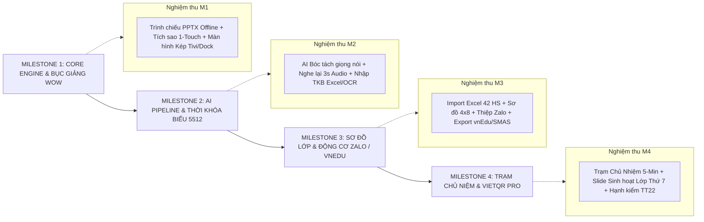

# 🚀 BẢN THIẾT KẾ TRIỂN KHẢI MASTER & LỘ TRÌNH PHÂN KÌ KỸ THUẬT (MASTER PRODUCT IMPLEMENTATION & ENGINEERING BLUEPRINT)

> **Dự án:** **LênLớp / Avina Class** (*Teaching OS & Live Class Workspace*)  
> **Nguyên tắc cốt lõi:** *"Làm phần Lõi Bục Giảng (Core WOW Flow) thật tốt trước ➔ Mở rộng dần các Module quản lý theo Lộ trình phân kỳ khép kín ➔ Đảm bảo 100% tài liệu tham chiếu chi tiết từng bước."*

---

## 1. MÔ HÌNH QUY TRÌNH THỰC THI (ENGINEERING EXECUTION METHODOLOGY)

Để biến toàn bộ 18 màn hình và kiến trúc sản phẩm thành một ứng dụng hoàn chỉnh, ổn định và không bị nợ kỹ thuật (technical debt) hay phình phạm vi (scope creep), hệ thống triển khai theo **Quy Trình Triển Khai 4 Cột Mốc Kỹ Thuật (4-Milestone Progressive Roadmap)**:



---

## 2. CHI TIẾT 4 CỘT MỐC TRIỂN KHẢI & TIÊU CHÍ NGHIỆM THU (ACCEPTANCE CRITERIA)

### 🟢 MILESTONE 1: HẠ TẦNG LÕI BỤC GIẢNG & TRẢI NGHIỆM WOW (CORE WOW FLOW)
> **Mục tiêu:** Xây dựng phần LÕI quan trọng nhất của ứng dụng: Đảm bảo giáo viên lên bục giảng trình chiếu slide offline mượt mà 100%, không bị đứt gãy mạch giảng.

* **Nhiệm vụ Kỹ thuật Chi tiết:**
  1. **Hạ tầng Local-First Storage:** Khởi tạo SQLite / IndexedDB lưu trữ cấu trúc bài giảng, sĩ số và điểm sao tích lũy.
  2. **Bộ đọc PowerPoint / PDF Reader:** Tích hợp bộ đọc Slide mượt mà, hỗ trợ định dạng PPTX, PDF, Video MP4 chạy offline.
  3. **Kiến trúc Màn hình Kép (Dual-Screen Window Manager):** 
     - Window A (Tivi View): Trình chiếu slide tràn màn hình + Floating Toast nhận thưởng hạt sáng.
     - Window B (Teacher Dock View): Thanh trợ lý riêng tư cho giáo viên tích sao 1-Touch.
  4. **Bộ tổng hợp âm thanh Web Audio Synthesizer:** Âm thanh "Ting ting" khi khen thưởng.
  5. **Bút trình chiếu USB Hotkeys:** Lắng nghe phím bấm PageDown / PageUp từ USB Clicker.
  6. **Launchpad 1-Click:** Tự động phát hiện tiết học sắp diễn ra và bật nút 1-Click Launch.

* **Tiêu chí Nghiệm thu Milestone 1 (Definition of Done - DoD M1):**
  - [x] Giáo viên kéo file PPTX vào app ➔ Bấm `[Bắt đầu dạy 1-Click]` ➔ Màn hình Tivi mở slide sắc nét.
  - [x] Bấm chạm Avatar học sinh trên thanh Dock ➔ Màn hình Tivi lập tức nổi hạt sáng + hiện tiếng "Ting ting".
  - [x] Dùng Bút trình chiếu USB bấm Next/Back Slide phản hồi trong <50ms.

---

### 🔵 MILESTONE 2: TRỢ LÝ AI LẮNG NGHE & SOẠN BÀI 5512 (AI PIPELINE & PRE-CLASS)
> **Mục tiêu:** Đưa trí tuệ nhân tạo AI bóc tách giọng nói vào tiết học và số hóa công tác chuẩn bị bài dạy 5512.

* **Nhiệm vụ Kỹ thuật Chi tiết:**
  1. **On-Device STT Engine (Kích hoạt Từ khóa Sư phạm):** 
     - Lắng nghe Micro giáo viên, bóc tách các câu khen ("Mời em An...", "Thầy khen em Minh...").
     - Tự động cắt và lưu trữ 3 giây audio bối cảnh xung quanh câu nói.
  2. **Bảng Chốt Tiết AI 60s (Post-Class Review Board):**
     - Đề xuất bản nháp nhận xét + điểm sao.
     - Tích hợp tính năng bấm nghe lại 3s audio bối cảnh gốc qua loa.
  3. **Trình biên soạn Gói Tiết Dạy 5512 (Lesson Capsule Editor):**
     - Soạn 4 hoạt động 5512 (*Khởi động, Khám phá, Luyện tập, Vận dụng*).
     - Đóng gói file bài giảng + link Quizizz/Canva + Cache Offline.
  4. **Ma trận Thời khóa biểu Tuần (Timetable Matrix):**
     - Thuật toán tự xếp tiết học vào 6 ngày x 10 tiết.
     - Bộ đọc Excel TKB & Quét ảnh TKB bằng AI OCR (Tesseract / Vision API).

* **Tiêu chí Nghiệm thu Milestone 2 (DoD M2):**
  - [x] Nói vào Micro câu *"Khen em An phát biểu trôi chảy"* ➔ Cuối tiết Bảng AI nháp xuất hiện đúng em An.
  - [x] Bấm `[🔊 Play 3s Audio]` ➔ Loa phát lại chính xác câu nói vừa rồi của giáo viên.
  - [x] Upload file ảnh Thời khóa biểu ➔ AI đọc chính xác 100% tiết dạy và điền vào lịch tuần.

---

### 🟣 MILESTONE 3: QUẢN LÝ LỚP & ĐỘNG CƠ XUẤT BÁO CÁO (CLASS MGMT & ZALO ENGINE)
> **Mục tiêu:** Quản lý toàn bộ 42 học sinh, xếp sơ đồ bàn học thực tế và tự động hóa công tác truyền thông phụ huynh.

* **Nhiệm vụ Kỹ thuật Chi tiết:**
  1. **Động cơ Import Excel Danh sách Lớp:** Bộ đọc Excel thần tốc nạp 42+ học sinh (Họ tên, Mã HS, Ngày sinh, SĐT Zalo Phụ huynh).
  2. **Sơ đồ Chỗ ngồi 4x8 (Interactive Seating Chart):**
     - Ma trận bàn học 4 dãy x 8 bàn.
     - Hiển thị Avatar, tên học sinh và tổng số sao tích lũy.
  3. **Bộ Tạo Thiệp Zalo Infographic Canvas Engine:**
     - Tự động render ảnh Thiệp báo cáo tuần sắc nét (.PNG) theo mẫu thiết kế.
     - Tích hợp nút gửi Zalo Phụ huynh 1-Click.
  4. **Động cơ Xuất dữ liệu chuẩn Bộ GD&ĐT (Export Engine):**
     - Xuất file Excel/CSV đúng template chuẩn của **vnEdu (VNPT)**, **SMAS (Viettel)**, **eNetViet**.

* **Tiêu chí Nghiệm thu Milestone 3 (DoD M3):**
  - [x] Nạp file Excel danh sách lớp ➔ Hiển thị đầy đủ 42 học sinh trên bảng và sơ đồ chỗ ngồi.
  - [x] Chọn 1 học sinh ➔ Sinh ngay file ảnh Thiệp Zalo đẹp mắt trong <1 giây.
  - [x] Bấm `[Xuất Excel vnEdu]` ➔ Tải về file `.xlsx` nộp BGH không bị lỗi font hay sai định dạng.

---

### 🟠 MILESTONE 4: TRẠM CHỦ NIỆM DUAL-LOOP & VIETQR PRO (HOMEROOM & SUBSCRIPTION)
> **Mục tiêu:** Hoàn thiện Module Quản Lý Chủ Nhiệm (Module 7), chốt Hạnh kiểm TT22 và thương mại hóa gói VietQR Pro.

* **Nhiệm vụ Kỹ thuật Chi tiết:**
  1. **Morning Check-in 5 Phút:** Widget báo cáo sĩ số vắng đầu ngày & nhắc thu quỹ/sổ đoàn.
  2. **Trạm Tụ Điểm Đa Bộ Môn (Cross-Subject Data Hub):** Thu thập toàn bộ sao thưởng & vi phạm từ các GVBM khác về lớp chủ nhiệm.
  3. **Trình chiếu Tiết Sinh Hoạt Lớp Thứ 7 (Homeroom Class Presenter):**
     - AI tự động tính toán thi đua giữa các Tổ và sinh Slide trình chiếu Thứ 7.
     - Vinh danh Ngôi sao tuần với hiệu ứng pháo hoa.
  4. **Chốt Hạnh Kiểm / Rèn Luyện Chuẩn Thông Tư 22:** 
     - Ma trận đề xuất xếp loại (*Tốt / Khá / Đạt / Chưa đạt*) kèm minh chứng.
     - 1-Click đẩy dữ liệu trực tiếp lên vnEdu / SMAS.
  5. **Tích hợp Thanh Toán VietQR Auto-Sync (PayOS / Sepay):**
     - Sinh mã VietQR biến đổi theo cú pháp chuyển khoản.
     - Webhook tự động kích hoạt tài khoản Pro trong 3 giây khi nhận tiền.

* **Tiêu chí Nghiệm thu Milestone 4 (DoD M4):**
  - [x] Đến tiết Thứ 7, bấm 1-Click ➔ Màn hình Tivi chiếu ngay Slide Thi đua Tổ 1 vs Tổ 2 vs Tổ 3.
  - [x] Bấm `[1-Click Đồng Bộ TT22]` ➔ Xếp loại rèn luyện 42 học sinh được đẩy lên vnEdu.
  - [x] Quét VietQR 50,000đ từ App Ngân hàng ➔ App tự nhảy thông báo *"Đã nâng cấp LênLớp PRO thành công!"*.

---

## 3. HỆ THỐNG MA TRẬN TÀI LIỆU THAM CHIẾU TOÀN DIỆN (COMPLETE DOCUMENTATION MATRIX)

Để đảm bảo chuyển giao chính xác từ bản hoạch định Master xuống các đội ngũ thực thi chi tiết, dự án duy trì **Hệ Thống Bộ 8 Tài Liệu Tham Chiếu Chuyên Biệt Hóa**:

```
                                  [BẢN THIẾT KẾ TRIỂN KHẢI MASTER]
                                      (Lo_Trinh_Trien_Khai_Master.md)
                                                     │
         ┌───────────────────────────────────────────┼───────────────────────────────────────────┐
         │                                           │                                           │
         ▼                                           ▼                                           ▼
 [DÀNH CHO ĐỘI NGŨ DEV]                     [DÀNH CHO ĐỘI NGŨ QA/TEST]                 [DÀNH CHO ĐỘI NGŨ UI/UX]
 📄 Technical_Spec_Architecture            📄 QA_Test_Cases_Acceptance                📄 UIUX_Design_System_Micro
    _DataSchema.md                            _Criteria.md                               Interactions.md
 • Schema SQLite/IndexedDB                  • Kịch bản E2E Test                        • CSS Design Tokens
 • API & State Mutations                    • Benchmark Hiệu năng                      • 12 Sub-modals & Drawers
 • Event Bus Dual-Screen IPC                • Privacy Test Checklist                   • Animation Physics Specs
 • Local-First & Sync Protocol                                                         • Font Size xem từ 5-7m
```

### Bảng Phân Công Tài Liệu Tham Chiếu Theo Vai Trò:

| STT | Tên Tài Liệu Tham Chiếu Chi Tiết | Đường Dẫn File | Vai Trò & Đối Tượng Sử Dụng |
| :---: | :--- | :--- | :--- |
| 1 | **Mô Tả Sản Phẩm Master** | [Mo_Ta_San_Pham.md](file:///d:/SDE%20Software/9Teach/Mo_Ta_San_Pham.md) | **Product Owner / BGH:** Tầm nhìn, 3 USPs, Vòng lặp khép kín 4 giai đoạn & Kiến trúc Chủ nhiệm. |
| 2 | **Chiến Lược Kinh Doanh & GTM** | [Chien_Luoc_Kinh_Doanh.md](file:///d:/SDE%20Software/9Teach/Chien_Luoc_Kinh_Doanh.md) | **Business / Marketing:** Mô hình ARR $1M-$3M, GTM B2C2B, Thuế phần mềm 0% VAT. |
| 3 | **Chiến Lược Cạnh Tranh & Wedge** | [Chien_Luoc_Canh_Tranh.md](file:///d:/SDE%20Software/9Teach/Chien_Luoc_Canh_Tranh.md) | **Product Strategy:** Điểm chen chân Bục giảng, 4 Lợi thế so sánh với vnEdu, SMAS & ClassDojo. |
| 4 | **Bản Thiết Kế Triển Khai Master** | [Lo_Trinh_Trien_Khai_Master.md](file:///d:/SDE%20Software/9Teach/Lo_Trinh_Trien_Khai_Master.md) | **Project Manager:** Lộ trình 4 Cột mốc Kỹ thuật (M1-M4) & Quy trình quản lý tổng thể. |
| 5 | **Quy Chuẩn UI/UX 18 Màn Hình** | [Danh_Sach_Man_Hinh_UIUX.md](file:///d:/SDE%20Software/9Teach/Danh_Sach_Man_Hinh_UIUX.md) | **UI/UX Designer:** Chi tiết 18 Màn hình chính / 7 Module & Quy chuẩn Left Sidebar 88px. |
| 6 | **Cấu Trúc Dữ Liệu & Event Bus** | [Technical_Spec_Architecture_DataSchema.md](file:///d:/SDE%20Software/9Teach/Technical_Spec_Architecture_DataSchema.md) | **Developers (Dev):** Schema Database, Event Emitter, Dual-Screen IPC & Xử lý lỗi Edge Cases. |
| 7 | **Kiến Trúc Core & Cắt Dọc Luồng** | [Core_Architecture_Senior_Dev_Spec.md](file:///d:/SDE%20Software/9Teach/Core_Architecture_Senior_Dev_Spec.md) | **Senior Devs / Tech Lead:** Thiết kế 4 Cụm Core Engine (Store, Slide, Audio, Storage) & Vertical Slicing. |
| 8 | **Phân Công Tasks Chi Tiết Dev** | [Phan_Cong_Nhiem_Vu_Dev_Task_Breakdown.md](file:///d:/SDE%20Software/9Teach/Phan_Cong_Nhiem_Vu_Dev_Task_Breakdown.md) | **Đội Ngũ Dev:** Phân công chi tiết từng Task theo vai trò, Mô tả Kỹ thuật & DoD nghiệm thu. |
| 9 | **Bộ Kịch Bản Kiểm Thử & DoD** | [QA_Test_Cases_Acceptance_Criteria.md](file:///d:/SDE%20Software/9Teach/QA_Test_Cases_Acceptance_Criteria.md) | **QA / Testers:** Kịch bản E2E Test, Tiêu chuẩn Hiệu năng & Privacy Test Checklist. |
| 10 | **Design System & Micro-Interactions** | [UIUX_Design_System_MicroInteractions.md](file:///d:/SDE%20Software/9Teach/UIUX_Design_System_MicroInteractions.md) | **Frontend / UI Designer:** CSS Tokens, 12 Sub-modals/Drawers & Animation Keyframe Specs. |
| 11 | **Hướng Dẫn Lập Trình Chi Tiết A-Z** | [Huong_Dan_Lap_Trinh_Chi_Tiet_A_Z.md](file:///d:/SDE%20Software/9Teach/Huong_Dan_Lap_Trinh_Chi_Tiet_A_Z.md) | **Toàn Đội Ngũ Thực Thi:** Hướng dẫn chi tiết nối ghép từng File, View Controller & Đóng gói sản phẩm. |
| 12 | **Phân Rã Task Agile 8 Sprints** | [Agile_Sprint_Backlog_Task_Decomposition.md](file:///d:/SDE%20Software/9Teach/Agile_Sprint_Backlog_Task_Decomposition.md) | **Scrum Master / Devs:** Lộ trình 8 Sprints phân rã 38 Tasks Agile (1-5 SP) cho toàn bộ 7 Module sản phẩm. |
| 13 | **Kiến Trúc K12 & Mạng Đồng Bộ** | [Kien_Truc_K12_NamHoc_MonHoc_TruongHoc.md](file:///d:/SDE%20Software/9Teach/Kien_Truc_K12_NamHoc_MonHoc_TruongHoc.md) | **Senior Architect:** Chuẩn hóa Môn GDPT 2018, Chuyển giao Năm học mới & Đồng bộ P2P/Cloud Mesh trường học. |

---

## 4. TỔ CHỨC CẤU TRÚC MÃ NGUỒN CHUẨN SENIOR ARCHITECT

Toàn bộ bộ mã nguồn được duy trì theo **Mô hình Clean Modular Architecture**:

```
d:\SDE Software\9Teach\
├── index.html                                  # Single Page Application Mounting Root
├── package.json                                # Dependencies & Scripts
├── vite.config.js                              # Vite Server & Build Configurations
│
├── Mo_Ta_San_Pham.md                           # [Tham chiếu 1] Hồ sơ Mô tả Sản phẩm
├── Chien_Luoc_Kinh_Doanh.md                    # [Tham chiếu 2] Hồ sơ Chiến lược Kinh doanh
├── Danh_Sach_Man_Hinh_UIUX.md                  # [Tham chiếu 3] Hồ sơ UI/UX 18 Màn hình
├── Chien_Luoc_Canh_Tranh.md                    # [Tham chiếu 4] Hồ sơ Chiến lược Cạnh tranh
├── Lo_Trinh_Trien_Khai_Master.md               # [Tham chiếu 5] Bản Thiết Kế Triển Khai Master
│
└── src/
    ├── main.js                                 # Application Bootstrapper & Router Register
    ├── config/                                 # App Configurations & Mock Data Isolations
    ├── core/                                   # Store (Pub/Sub), Router, AudioSynthesizer
    ├── styles/                                 # Modular Design Tokens & View Stylesheets
    └── views/                                  # OOP View Controllers (Scr 1.1 ➔ Scr 7.5)
```

---

> 📌 **Kết luận:**  
> Bản thiết kế triển khai Master này đóng vai trò như **Kim chỉ nam kỹ thuật (Engineering Compass)**. Khi bắt tay vào lập trình thực tế, chúng ta sẽ lần lượt hoàn thiện và nghiệm thu dứt điểm từng Milestone (từ M1 ➔ M2 ➔ M3 ➔ M4), đảm bảo sản phẩm ra đời đúng 100% tầm nhìn đã cam kết!
