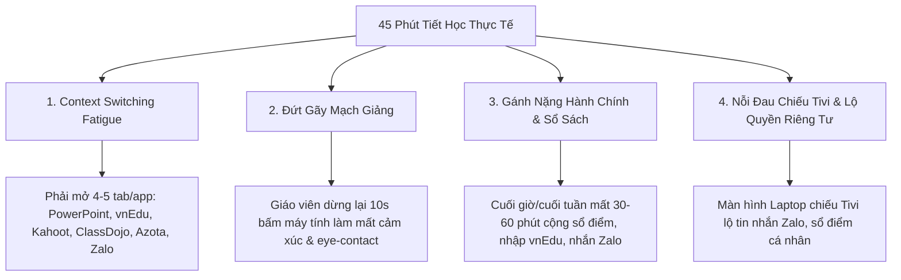
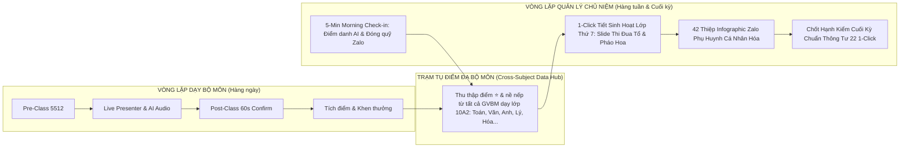
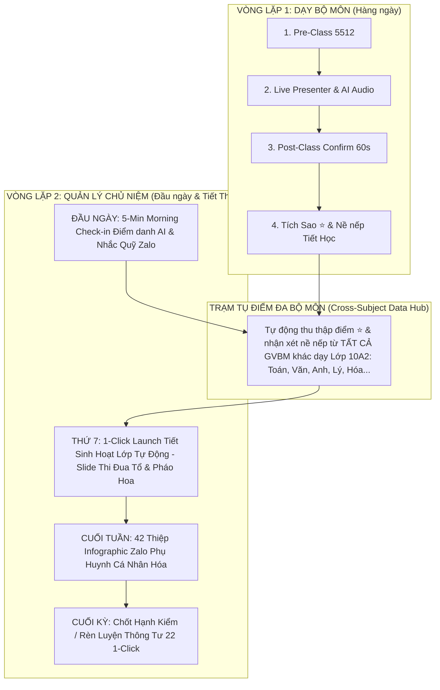
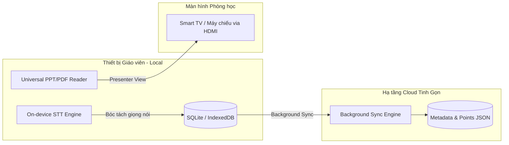
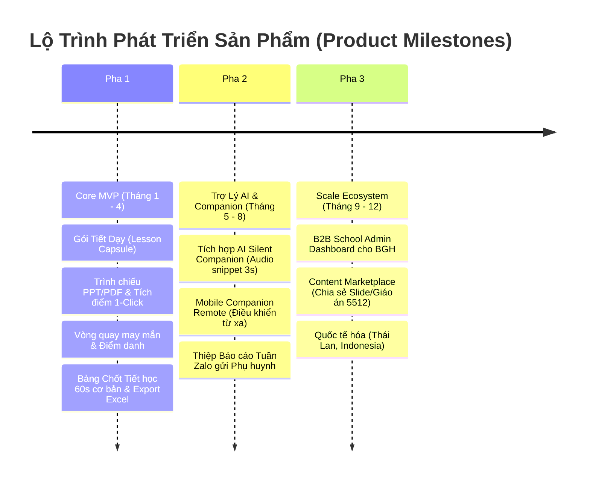

# 📘 TÀI LIỆU MÔ TẢ SẢN PHẨM: LIVE CLASS WORKSPACE / TEACHING OS
> **Tên dự án kiến nghị:** **LênLớp** *(B2C Bình dân/Thuần Việt)* hoặc **Avina Class** *(B2C & B2B Chính thống)* / **ClassFlow** *(Quốc tế)*  
> **Khẩu hiệu (Tagline):** *"Giữ trọn mạch giảng – Nâng tầm tiết học"*  
> **Định vị cốt lõi:** Hệ điều hành Giảng dạy & Trợ lý Tiết học 1-Click dành cho Giáo viên Phổ thông (K-12).

---

## 1. BỐI CẢNH VÀ NỖI ĐÂU CỦA GIÁO VIÊN VIỆT NAM (PROBLEM STATEMENT)

Trong 45 phút trên lớp tại các trường học Việt Nam (từ công lập đến tư thục), giáo viên đang gặp phải 4 nhóm "nỗi đau" lớn khiến công việc giảng dạy trở nên mệt mỏi và phân mảnh:



### 1.1. Sự Phân Mảnh Công Cụ (Context Switching Fatigue)
- Giáo viên phải chuyển đổi liên tục giữa 4 – 5 công cụ riêng rẻ:
  - **Điểm danh & Nhận lớp:** vnEdu Connect, eNetViet, SMAS hoặc Sổ tay giấy.
  - **Giảng bài & Trình chiếu:** Microsoft PowerPoint, Canva, ClassPoint, myViewBoard.
  - **Thi đua & Game hóa:** ClassDojo (quái vật cộng điểm), Kahoot!, Quizizz, Vòng quay may mắn.
  - **Chấm bài & Giao bài:** Azota, Google Classroom, OLM.
  - **Lưu trữ & Trao đổi:** Zalo PC, Google Drive, USB.
- Việc thao tác trên nhiều phần mềm khác nhau ngốn rất nhiều thời gian chuẩn bị và tâm trí (cognitive load) của giáo viên trong 45 phút lên lớp.

### 1.2. Đứt Gãy Mạch Giảng & Mất Kết Nối (Interrupted Teaching Flow)
- Trong các môn học đòi hỏi **thăng hoa cảm xúc và thuyết giảng liên tục** (đặc biệt như Ngữ văn, Lịch sử, Địa lý, GDCD), nếu giáo viên phải dừng lại 5–10 giây để cúi xuống máy tính rê chuột, chọn tên học sinh, bấm cộng điểm hay gõ nhận xét, **mạch cảm xúc của bài giảng sẽ bị đứt gãy ngay lập tức**.
- Hạn chế của việc *"giáo viên tự nhớ rồi tổng hợp cuối tiết"*:
  - **Thiếu tính tức thì (Immediate Feedback):** Học sinh phát biểu hay nhưng không được vinh danh ngay.
  - **Quá tải ghi nhớ (Cognitive Overload):** Một tiết học có 15–20 lượt phát biểu định tính (chuẩn ý chưa, tự tin không, diễn đạt trôi chảy không...), giáo viên không thể nhớ chính xác từng học sinh ở cuối giờ.

### 1.3. Nỗi Đau Chiếu Màn Hình Tivi / Máy Chiếu (HDMI Mirroring Risk)
- Khoảng 90% phòng học phổ thông Việt Nam trang bị Smart TV (55–75 inch) hoặc Máy chiếu nối cáp HDMI trực tiếp vào máy tính bàn/Laptop của giáo viên (chế độ Duplicate/Mirror).
- **Rủi ro riêng tư:** Mọi thao tác cá nhân trên máy tính (như thông báo tin nhắn Zalo, sổ điểm riêng, nhận xét nhạy cảm) đều bị học sinh bên dưới nhìn thấy trực tiếp trên Tivi.

---

## 2. TẦM NHÌN & GIẢI PHÁP SẢN PHẨM (PRODUCT VISION & USP)

Ứng dụng được thiết kế để trở thành **Nơi Làm Việc Khép Kín (Teaching OS / Live Class Workspace)** – một điểm đến duy nhất (*Single Source of Truth*) cho toàn bộ quy trình dạy học của giáo viên. Giáo viên chỉ cần mở ứng dụng, bấm **[Bắt đầu Tiết học]**, tất cả giáo án, slide, video, công cụ điểm danh và tích điểm đều đã sẵn sàng ở đúng vị trí.

```
┌───────────────────────────────────────────────────────────────────────────────────────────────────┐
┌                                    TEACHING OS (NƠI LÀM VIỆC)                                     │
├──────────────────┬──────────────────────┬──────────────────────────┬──────────────────────────────┤
│ 1. CHUẨN BỊ      │ 2. TRONG TIẾT DẠY    │ 3. SAU TIẾT DẠY          │ 4. TỔNG KẾT BÁO CÁO          │
│  (Pre-Class)     │   (Live Class)       │   (Post-Class)           │   (Periodical Summary)       │
├──────────────────┼──────────────────────┼──────────────────────────┼──────────────────────────────┤
│ • Soạn/Import    │ • Mở lớp 1-Click     │ • Tổng kết Tiết học      │ • Bảng điều khiển (Dashboard)│
│   Giáo án 5512   │ • Trình chiếu Slide/ │   (Sĩ số, Học sinh xuất  │   nề nếp & học tập       │
│ • Tạo "Gói tài   │   Video tích hợp     │   sắc nhất tiết)         │ • Báo cáo gửi Phụ huynh      │
│   nguyên tiết"   │ • Trợ lý dạy học:    │ • Giao bài tập về nhà    │ • Xuất file Excel/PDF nộp    │
│   (PPT, Link,    │   Điểm danh, Tích    │ • Đồng bộ Sổ ghi đầu bài │   BGH / Đẩy vào vnEdu,       │
│   PDF, Quiz)     │   điểm 1-Touch, Vòng │   tự động                │   eNetViet                   │
│                  │   quay, Đồng hồ      │                          │                              │
└──────────────────┴──────────────────────┴──────────────────────────┴──────────────────────────────┘
```

### 3 Điểm Khác Biệt Cốt Lõi (Unique Selling Propositions - USPs):

1. **Màn Hình Kép & Remote Trình Chiếu Đơn Giản (Dual-Screen & Slide Remote):**
   - Màn hình Tivi chỉ hiển thị giao diện trình chiếu bài giảng sắc nét và hiệu ứng vinh danh/ngôi sao.
   - Remote (Bút trình chiếu PowerPoint USB vật lý hoặc Web Remote trên điện thoại) trước mắt tập trung **tối giản hỗ trợ chuyển Slide (Next / Back Slide)** linh hoạt khi giáo viên đi lại giảng bài, giữ đúng thói quen quen thuộc 100% của giáo viên.
2. **Trợ Lý AI Lắng Nghe Thầm Lặng (Silent AI Companion + Human-in-the-Loop):**
   - AI chạy ngầm bóc tách giọng nói giáo viên qua Micro, tự động nhận diện tên học sinh, tiêu chí đánh giá (tự tin, trôi chảy, đúng ý) và lưu lại audio bối cảnh 3 giây.
   - Cuối giờ, AI đề xuất bản nháp 60 giây để giáo viên xem lại, bấm nghe audio bối cảnh nếu quên, tùy chỉnh và duyệt chỉ với 1-Click.
3. **Hoạt Động Mượt Mà Offline (Local-First Architecture):**
   - Đảm bảo 100% không bị đứng hay xoay vòng khi Wifi trường học chập chờn hay đứt mạng. Toàn bộ slide, video chạy offline mượt mà; dữ liệu tự động đồng bộ ngầm (Background Sync) lên Cloud khi có mạng trở lại.

---

## 3. CHI TIẾT QUY TRÌNH VẬN HÀNH KHẾP KÍN 4 GIAI ĐOẠN

### 🟢 Giai Đoạn 1: CHUẨN BỊ (Pre-Class) – "Gói Tài Nguyên Tiết Dạy" (Lesson Capsule)
- **Tập trung hóa tài nguyên:** Thay vì lưu file rải rác ở desktop, ổ D hay Bookmark trình duyệt, phần mềm quản lý theo **Thời khóa biểu & Tiết học**.
- **Tạo Gói Tiết Dạy (Lesson Capsule):** Với mỗi tiết học (VD: *Môn Ngữ Văn - Lớp 10A2 - Tiết 18: Phân tích nhân vật*), giáo viên đóng gói toàn bộ:
  - Slide trình chiếu (PowerPoint `.pptx`, PDF, Canva link).
  - Video minh họa (`.mp4`, Youtube link) hoặc bài giảng SCORM.
  - Link trò chơi trắc nghiệm (Quizizz / Kahoot).
  - Khung Kế hoạch bài dạy chuẩn **Công văn 5512** (4 hoạt động: Khởi động ➔ Khám phá ➔ Luyện tập ➔ Vận dụng).
- **Trạng thái Offline Readiness:** Hệ thống tự động lưu cache toàn bộ Slide/Video về máy local trước giờ lên lớp.

---

### 🟢 Giai Đoạn 2: TRONG TIẾT DẠY (Live Class Workspace) – "Màn Hình Làm Việc 1-Click"
- **2 Luồng Vào Tiết Dạy Linh Hoạt:**
  1. *Vào từ Thời khóa biểu tổng quan:* Giáo viên xem lịch tuần (Thứ 2 - Thứ 7), chọn bất kỳ ô tiết học nào để bấm `[Vào Tiết Dạy]` hoặc xem/chỉnh sửa tài nguyên.
  2. *Vào 1-Click từ Launchpad (Trang chủ):* Khi mở app tại phòng học, Launchpad dựa vào đồng hồ thời gian thực để tự động nhận diện và làm nổi bật **"Tiết học đang diễn ra / Sắp đến giờ"** (VD: *Thứ 3, Tiết 2 - Lớp 10A2*). Nút khổng lồ `[🚀 BẮT ĐẦU DẠY TIẾT HỌC]` tự động mở đúng gói tài nguyên của tiết đó mà không cần tìm kiếm.
- **Giao diện Trình chiếu & Trợ lý 2-in-1 (Presenter View):**
  - **Khu vực trung tâm Tivi:** Trình chiếu Slide, Video sắc nét, giữ nguyên 100% hiệu ứng animation và font chữ.
  - **Thanh công cụ Trợ lý (Side Dock / Overlay Toolbar):** 
    - ✋ **Điểm danh 1-Touch:** Hiện sơ đồ lớp trực quan, chạm 1 cái để đánh dấu vắng/muộn.
    - ⭐ **Tích điểm 1-Click:** Bấm vào Avatar học sinh ➔ Tivi phát ra tiếng "Ting ting" sinh động kèm hiệu ứng ngôi sao/quái vật bay lên.
    - 🎡 **Bộ công cụ tương tác tức thì:** Vòng quay gọi tên ngẫu nhiên, Đồng hồ đếm giờ làm bài, Chuông báo hết giờ, Bảng nhóm thi đua.
- **Chế độ Remote Trình chiếu (Next/Back Slide):** 
  - Tích hợp 100% Bút trình chiếu PowerPoint USB truyền thống (bấm nút Next/Back trên bút để chuyển trang).
  - Hỗ trợ Web Remote đơn giản trên Điện thoại: Giao diện tối giản 2 nút bấm to `[◄ Slide Trước]` và `[Slide Tiếp ►]` hoặc vuốt cảm ứng để giáo viên chuyển slide khi đứng xa máy tính.

---

### 🟢 Giai Đoạn 3: SAU TIẾT DẠY (Post-Class) – "Chốt Tiết Học 60 Giây"
- **Bảng Duyệt Đánh Giá AI 60 Giây (Human-in-the-Loop):** Khi giáo viên bấm **[Kết thúc Tiết học]**, màn hình điều khiển riêng của giáo viên hiển thị Bảng tổng kết nháp do AI lắng nghe bóc tách trong giờ.

```
┌────────────────────────────────────────────────────────────────────────────────────────┐
│                        BẢNG XÁC NHẬN ĐÁNH GIÁ TIẾT HỌC (AI DRAFT)                      │
├────────────────────────────────────────────────────────────────────────────────────────┤
│                                                                                        │
│  [18:25 - Slide 5: Phân tích nhân vật]                                                │
│  🤖 AI Đề xuất: [Em An]  ──►  +2 Sao (Diễn đạt trôi chảy)  │  📝 Note: Bổ sung ý 2     │
│  ────────────────────────────────────────────────────────────────────────────────────  │
│  Sửa tên: [ An ▾ ] (Gợi ý: Anh, Ánh)   │  Điểm: [ ⭐ ][ ⭐ ][ ⭐ ]                       │
│  🎧 [🔊 Nghe lại 3s âm thanh gốc]      │  [ Thêm huy hiệu ▾ ]                          │
│                                                                                        │
│  ------------------------------------------------------------------------------------  │
│                                                                                        │
│  [27:10 - Slide 8: Luyện tập câu hỏi]                                                  │
│  🤖 AI Đề xuất: [Em Minh] ──► +1 Sao (Phát biểu đúng)                                   │
│                                                                                        │
├────────────────────────────────────────────────────────────────────────────────────────┤
│                     [ ✖ Hủy tất cả ]             [ ✔ XÁC NHẬN & VINH DANH ]            │
└────────────────────────────────────────────────────────────────────────────────────────┘
```

- **Các tính năng UX nòng cốt tại Bảng Chốt Tiết:**
  1. **Sửa nhầm tên 1-Click (An vs Anh):** Menu thả xuống gợi ý học sinh có tên tương tự hoặc học sinh ngồi ở vị trí tương ứng.
  2. **Nghe lại Audio bối cảnh 3 giây (Context Replay):** Bấm nút `[🔊 Play 3s]` để loa điện thoại phát lại chính câu nói của giáo viên lúc đó ("Thầy khen em Anh diễn đạt rất trôi chảy..."), giúp giáo viên nhớ lại ngay bối cảnh mà không bị nhầm lẫn.
  3. **Tự do điều chỉnh:** Tăng/giảm sao, gắn thêm Huy hiệu (Sáng tạo, Tự tin, Tốt bụng...).
- **Khoảnh khắc Vinh danh trên Tivi (Celebration Moment):** Ngay khi giáo viên bấm `[✔ XÁC NHẬN & VINH DANH]`, Tivi bùng nổ pháo hoa, bảng xếp hạng vinh danh tiết học xuất hiện rực rỡ trước cả lớp.
- **Tự động lưu Sổ ghi đầu bài điện tử:** Hệ thống ghi nhận sĩ số, tên bài dạy, danh sách học sinh xuất sắc và nhận xét tiết học.

---

### 🟢 Giai Đoạn 4: TỔNG KẾT TUẦN / THÁNG (Periodical Aggregation)
- **Báo cáo Phụ huynh tự động (Parent Report Card):** Cuối tuần, hệ thống tự động tổng hợp dữ liệu nề nếp và học tập thành một **"Thiệp Báo Cáo AI Tuần"** gửi qua Zalo/App cho Phụ huynh (VD: *"Tuần này em An đã nhận 15 điểm thưởng, hăng hái phát biểu 5 lần, đạt huy hiệu Diễn đạt trôi chảy..."*).
- **Bảng điều khiển Thi đua (Dashboard):** Biểu đồ theo dõi sự tiến bộ của từng học sinh, thi đua giữa các Tổ / các Lớp.
- **Động cơ Xuất Dữ Liệu chuẩn Bộ GD&ĐT (Export Engine):** Xuất file Excel/CSV chuẩn định dạng của các hệ thống bắt buộc (vnEdu, eNetViet, SMAS) để giáo viên nộp cho BGH hoặc copy-paste trong 5 giây.

---

### 🔵 3.5. TÍCH HỢP MODULE QUẢN LÝ CHỦ NIỆM VÀO VÒNG KHÉP KÍN (DUAL-LOOP HOMEROOM ARCHITECTURE)

Giáo viên phổ thông Việt Nam thường đóng hai vai trò: **Giáo viên Bộ môn (GVBM)** và **Giáo viên Chủ nhiệm (GVCN)**. Khi phát triển thêm Module Quản Lý Chủ Nhiệm, sản phẩm nâng cấp thành **Kiến Trúc Vòng Lặp Kép (Dual-Loop Architecture)** hợp nhất 2 dòng công việc vào một luồng khép kín duy nhất:



#### Cách Module Chủ Nhiệm Vận Hành Khép Kín Qua 4 Mắt Xích:
1. **Đầu ngày (5-Minute Morning Check-in trên Launchpad):** 
   - Vừa mở Launchpad, AI nhắc ngay: *"Lớp chủ nhiệm 10A2 hôm nay có 41/42 học sinh có mặt. Em Dũng xin phép nghỉ ốm qua Zalo phụ huynh lúc 6:45 AM"*. Nhắc việc thu quỹ/sổ đoàn.
2. **Trong tuần (Thu thập dữ liệu Đa Bộ Môn / Cross-Subject Aggregation):** 
   - Khi các GVBM khác (thầy dạy Toán, cô dạy Anh...) tích sao ⭐ hoặc ghi nhận nhắc nhở học sinh lớp 10A2, toàn bộ dữ liệu tự động chảy ngầm về Trung tâm Chủ nhiệm của Cô Mai (GVCN). Cô Mai nắm trọn bức tranh nề nếp học tập mà không cần đi hỏi từng người.
3. **Thứ 7 (1-Click Launch Tiết Sinh Hoạt Lớp Thứ 7 - WOW Moment):** 
   - Đến tiết Sinh hoạt Lớp, Cô Mai bấm `[🚀 Bắt Đầu Tiết Sinh Hoạt Lớp]`. AI tự động sinh sẵn **Slide Trình Chiếu Sinh Hoạt Lớp** gồm:
     - Bảng xếp hạng Thi đua Tổ 1, Tổ 2, Tổ 3 (tự tính từ tổng sao cả tuần).
     - Vinh danh "Ngôi sao xuất sắc tuần" & "Học sinh tiến bộ".
     - Trình chiếu ảnh hoạt động và tổng kết nề nếp tự động.
4. **Cuối tuần & Cuối kỳ (Báo cáo Zalo & Chốt Hạnh kiểm TT22 1-Click):** 
   - Tự động sinh **42 Thiệp Zalo Phụ Huynh** gửi đồng loạt trong 30 giây.
   - Cuối học kỳ, AI tự động đề xuất mức xếp loại Rèn luyện / Hạnh kiểm (Tốt / Khá / Đạt) theo Thông tư 22 dựa trên toàn bộ nhật ký tích điểm ➔ GVCN chỉ cần xem & duyệt 1-Click.

---

SƠ ĐỒ KIẾN TRÚC VÒNG LẶP KÉP (DUAL-LOOP ARCHITECTURE):


## 4. ĐẶC TÍNH KỸ THUẬT & KIẾN TRÚC TRỆT ĐỂ (TECHNICAL ARCHITECTURE)



### 4.1. Kiến Trúc "Local-First" – Giải Bài Toán Mạng Wifi Trường Học
- **Lưu trữ phi tập trung:** Slide PPT, Video dung lượng nặng nằm hoàn toàn tại ổ cứng local của giáo viên hoặc Google Drive cá nhân.
- Cloud của ứng dụng chỉ lưu trữ **dữ liệu cấu trúc JSON cực nhẹ** (Metadata tiết học, điểm số nề nếp, log nhận xét).
- Chi phí hạ tầng Server nhờ đó tiệm cận mức tối thiểu, loại bỏ nguy cơ *"càng nhiều user càng lỗ nặng tiền lưu trữ cloud"*.

### 4.2. Trợ Lý AI Lắng Nghe Thông Minh (Smart AI Pipeline)
- **Kích hoạt từ khóa (Keyword Trigger):** AI không xử lý liên tục 45 phút để tiết kiệm tài nguyên. AI chỉ kích hoạt bóc tách khi phát hiện các từ khóa tương tác sư phạm ("Mời bạn...", "Thầy khen em...", "Ý của An rất...", "Bạn nào bổ sung...").
- **Xử lý On-device Speech-to-Text:** Tận dụng công nghệ STT chạy trực tiếp trên thiết bị (Whisper Web / Apple Speech / Web Speech API) để dịch giọng nói thành văn bản real-time mà không tốn phí API Cloud.
- **Dữ liệu Bối cảnh (Metadata Capture):** Lưu trữ 4 trường dữ liệu cho mỗi lượt: `Timestamp` + `Draft Text` + `Audio Snippet 3-5s` + `Slide Bối cảnh`.

---

## 5. MA TRẬN YÊU CẦU TÍNH NĂNG (FEATURE REQUIREMENTS MATRIX)

| Mã Tính Năng | Tên Tính Năng | Mô Tả Trải Nghiệm (UX) | Mức Độ Ưu Tiên (MVP) |
| :--- | :--- | :--- | :--- |
| **PRE-01** | Quản lý Thời khóa biểu | Ma trận lịch dạy 6 ngày x 10 tiết, Import file Excel TKB & Quét ảnh TKB bằng AI. | P0 (Bắt buộc) |
| **PRE-02** | Lesson Capsule (Gói tiết) | Kéo thả File PPTX, PDF, Video MP4, Link Quizizz vào từng tiết học. | P0 (Bắt buộc) |
| **PRE-03** | Trình soạn Kế hoạch 5512 | Mẫu chuẩn 4 hoạt động giáo án 5512 nhẹ nhàng, có gợi ý khung. | P1 (Nâng cao) |
| **LIVE-01** | Vào Tiết 1-Click | Mở đúng Gói tài nguyên tiết dạy hiện tại chỉ với 1 cú click. | P0 (Bắt buộc) |
| **LIVE-02** | Universal Presenter View | Trình chiếu PPTX/PDF mượt mà, giữ nguyên hiệu ứng & font tiếng Việt. | P0 (Bắt buộc) |
| **LIVE-03** | Điểm danh & Tích điểm 1-Touch | Giao diện sơ đồ lớp, chạm cộng điểm thưởng + âm thanh Tivi rực rỡ. | P0 (Bắt buộc) |
| **LIVE-04** | Bộ tương tác (Wheel/Timer) | Vòng quay gọi tên ngẫu nhiên, đồng hồ đếm giờ làm bài nhóm. | P0 (Bắt buộc) |
| **LIVE-05** | Remote Control trên Mobile | Điện thoại làm tay điều khiển vuốt cảm ứng 1-Touch riêng tư. | P1 (Nâng cao) |
| **POST-01** | AI Silent Companion | AI lắng nghe thầm lặng, bóc tách nhận xét & audio snippet bối cảnh. | P1 (Nâng cao) |
| **POST-02** | Bảng Chốt Tiết 60s | Giao diện duyệt nháp nhận xét AI, nghe lại audio 3s, sửa tên nhanh. | P0 (Bắt buộc) |
| **POST-03** | Vinh danh Tiết học (Recap) | Màn hình bùng nổ hiệu ứng vinh danh Top học sinh xuất sắc trên Tivi. | P0 (Bắt buộc) |
| **MGMT-01** | Quản lý Lớp & Import Excel | Tạo lớp học mới, Import danh sách học sinh từ file Excel do nhà trường cấp. | P0 (Bắt buộc) |
| **MGMT-02** | Kho Bài giảng & Tài nguyên | Quản lý kho slide, bài giảng, kế hoạch 5512 để tái sử dụng qua nhiều năm. | P1 (Nâng cao) |
| **MGMT-03** | Hồ sơ Nề nếp Học sinh | Biểu đồ biến thiên tiến bộ cá nhân, lịch sử nhận xét & sao thưởng tích lũy. | P1 (Nâng cao) |
| **REP-01** | Thiệp báo cáo Zalo Phụ huynh | Tự tạo thiệp tổng kết nề nếp & học tập tuần đẹp mắt gửi phụ huynh. | P1 (Nâng cao) |
| **REP-02** | Export Engine (vnEdu/SMAS) | Xuất file Excel/CSV đúng định dạng mẫu của Bộ GD&ĐT để nộp BGH. | P0 (Bắt buộc) |
| **SYS-01** | Cài đặt & Nâng cấp VietQR | Cấu hình Micro AI, phím tắt bút trình chiếu, thanh toán tự động VietQR Pro. | P0 (Bắt buộc) |

---

## 6. ĐƠN GIẢN HÓA LỘ TRÌNH PHÁT TRIỂN SẢN PHẨM (PRODUCT ROADMAP)



---

> 📌 **Ghi chú quan trọng:**  
> Tài liệu này tập trung **100% vào Định hình Sản phẩm, Trải nghiệm Người dùng (UX/UI) và Kiến trúc Kỹ thuật**.  
> *Chiến lược Kinh doanh chi tiết (Mô hình Tài chính, Định giá 1M-3M$ ARR, Kế hoạch Phân phối GTM 1,000 khách hàng đầu tiên, Pháp lý Công ty & Ưu đãi thuế phần mềm)* sẽ được tổng hợp trong một file tài liệu độc lập (`Chien_Luoc_Kinh_Doanh.md`).
