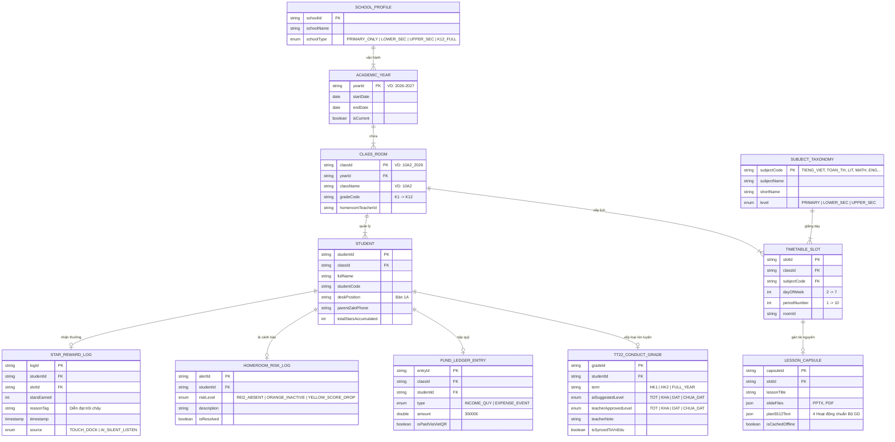
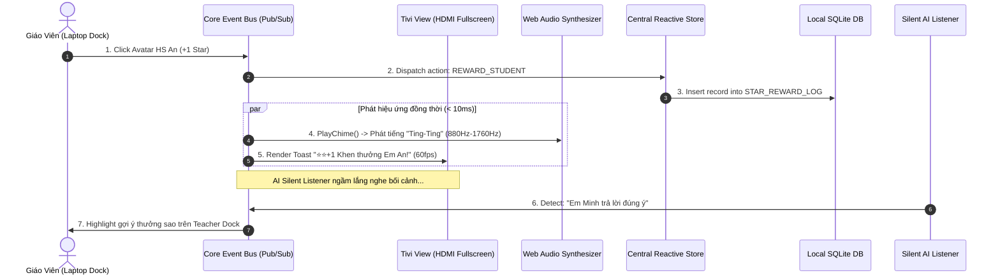

# 📐 BẢN THIẾT KẾ CƠ SỞ DỮ LIỆU, EVENT BUS & LUỒNG DỮ LIỆU KHÉP KÍN (SENIOR ARCHITECTURE SPECIFICATION)

> **Dự án:** TeachDS / LênLớp PRO — Digital Teaching Space Engine  
> **Tác giả:** Senior Lead Software Architect  
> **Ngày cập nhật:** 15/08/2026  
> **Trạng thái:** Master Architecture Standard for Production  

---

## 🏛️ 1. TỔNG QUAN KIẾN TRÚC BIRD'S-EYE VIEW

Hệ thống **TeachDS** vận hành theo mô hình **Local-First Event-Driven Architecture** (Kiến trúc hướng sự kiện, ưu tiên lưu trữ nội địa offline). Hệ thống gồm 3 tầng cốt lõi:
1. **Data Layer (SQLite WAL / IndexedDB):** Cơ sở dữ liệu nhất quán mã hóa cục bộ.
2. **Event & IPC Bus Layer (Pub/Sub Engine):** Trạm trung chuyển sự kiện thời gian thực giữa Màn hình Tivi cho Học sinh, Màn hình Dock cho Giáo viên và Trợ lý AI.
3. **Business Logic & View Layer (Clean Component View):** 18 Màn hình giao diện lặp vòng khép kín.

---

## 📊 2. SƠ ĐỒ QUAN HỆ CƠ SỞ DỮ LIỆU (DATABASE ERD DIAGRAM)

Dưới đây là sơ đồ mối quan hệ thực thể (**ERD**) hoàn chỉnh giải quyết toàn bộ bài toán **Giáo dục phổ thông K-12**, **Trường Liên Cấp (K-12 Full)** và **Chuyển giao năm học mới**:

---

## ⚡ 3. SƠ ĐỒ EVENT BUS & IPC SYSTEM (LUỒNG TƯƠNG TÁC SỰ KIỆN)

Hệ thống hoạt động theo mô hình **Event-Driven Bus**. Khi Giáo viên chạm tích sao trên Laptop, hoặc AI phát hiện câu phát biểu, Event Bus phát sóng thời gian thực đến tất cả các View:

---

## 🔄 4. MÔ TẢ 4 LUỒNG DỮ LIỆU KHÉP KÍN (CLOSED-LOOP DATA FLOWS)

Hệ thống đảm bảo **Vòng tròn dữ liệu khép kín 100%**, không đứt gãy từ lúc bắt đầu dạy đến khi chốt sổ nộp Bộ GD&ĐT:

```mermaid
flowchart TD
    subgraph VONG_1 [VÒNG TRÒN 1: BỤC GIẢNG LIVE CLASSROOM]
        A1[📅 Thời Khóa Biểu Tuần] -->|1-Click Launch| A2[🚀 Launchpad Tiết Học]
        A2 -->|Phát Slide & Tivi View| A3[🖥️ Live Presenter & Dock]
        A3 -->|Tích Sao 1-Touch / AI Lắng Nghe| A4[⭐ Ghi Nhận Reward Logs]
        A4 -->|Chốt 60s Cuối Tiết| A5[🤖 Post-Class Review & Pháo Hoa]
    end

    subgraph VONG_2 [VÒNG TRÒN 2: CHỦ NHIỆM & PHỤ HUYNH 360]
        A5 -->|Tự Động Gộp Điểm| B1[🎓 Homeroom Hub 360]
        B1 -->|AI Quét Vi Phạm & Vắng| B2[⚠️ Risk Radar Điểm Nóng AI]
        B2 -->|Tự Tạo Infographic| B3[📊 Thiệp Zalo Phụ Huynh]
        B1 -->|VietQR Gạch Nợ Auto| B4[💰 Sổ Thu Chi Quỹ Lớp]
    end

    subgraph VONG_3 [VÒNG TRÒN 3: ĐỒNG BỘ BỘ GD&ĐT]
        B1 -->|Tổng Hợp Cuối Kỳ| C1[📋 Ma Trận Đề Xuất TT22 AI]
        C1 -->|GVCN Phê Duyệt 1-Click| C2[✔ Chốt Xếp Loại Rèn Luyện]
        C2 -->|Nút 1-Click Sync| C3[📥 Push Data Lên vnEdu / SMAS Excel]
    end

    subgraph VONG_4 [VÒNG TRÒN 4: CHUYỂN GIAO NĂM HỌC MỚI]
        C3 -->|Kết Thúc Năm Học| D1[🔒 Read-Only Snapshot Lịch Sử 3 Năm]
        D1 -->|1-Click Lên Lớp mới| D2[⬆ Lên Lớp K10 -> K11 -> K12]
        D2 -->|Tạo Năm Học Mới| A1
    end

    style VONG_1 fill:#0f172a,stroke:#3b82f6,stroke-width:2px
    style VONG_2 fill:#0f172a,stroke:#10b981,stroke-width:2px
    style VONG_3 fill:#0f172a,stroke:#8b5cf6,stroke-width:2px
    style VONG_4 fill:#0f172a,stroke:#f59e0b,stroke-width:2px
```

---

### 📌 MÔ TẢ CHI TIẾT VÒNG TRÒN DỮ LIỆU:

#### 🟢 Vòng Tròn 1: Bục Giảng (Live Classroom Loop)
- **Đầu vào:** Lịch dạy theo Thời khóa biểu (`TIMETABLE_SLOT`).
- **Thực thi:** Giáo viên bấm `[🚀 1-Click Launch]`, hệ thống mở Slide 4K lên Tivi và Dock trợ lý cho Laptop. Khi tích sao hoặc AI lắng nghe, dữ liệu ghi vào `STAR_REWARD_LOG`.
- **Đầu ra:** Bảng chốt tiết 60s & Vinh danh Pháo hoa TOP 3 học sinh xuất sắc.

#### 🟢 Vòng Tròn 2: Sổ Chủ Nhiệm & Phụ Huynh 360 (Homeroom Loop)
- **Tích hợp liên môn:** Toàn bộ điểm sao thưởng và lượt phát biểu từ **tất cả Giáo viên bộ môn khác** tự động chảy về **Homeroom Hub** của GVCN.
- **AI Risk Radar:** Tự động phát hiện học sinh vắng > 3 tiết (`HOMEROOM_RISK_LOG`), tự động sinh **Thiệp Zalo Infographic** để gửi riêng cho từng phụ huynh.
- **VietQR Quỹ lớp:** Phụ huynh quét VietQR chuyển khoản 300k, hệ thống nhận Webhook tự động gạch nợ thành công (`FUND_LEDGER_ENTRY`).

#### 🟣 Vòng Tròn 3: Đồng Bộ Bộ GD&ĐT (Ministry Sync Loop)
- **Tổng hợp cuối kỳ:** Hệ thống quét toàn bộ lịch sử sao thưởng + sĩ số vắng để AI tính toán ma trận đề xuất xếp loại Rèn luyện (*Tốt/Khá/Đạt*) theo **Thông tư 22/2021/TT-BGDĐT**.
- **1-Click Export/Sync:** GVCN kiểm tra và bấm nút `[1-Click Sync]`, hệ thống tự động đẩy dữ liệu chuẩn sang **vnEdu (VNPT)** hoặc **SMAS (Viettel)** mà không cần nhập tay 1 dòng nào.

#### 🟠 Vòng Tròn 4: Chuyển Giao Năm Học Mới (Academic Year Rollover Loop)
- **Snapshot lịch sử:** Khi qua năm học mới (`2026-2027` ➔ `2027-2028`), dữ liệu năm học cũ được đóng gói thành **Read-Only Snapshot** lưu giữ trong 3 năm học THPT.
- **1-Click Lên Lớp:** Tự động đẩy danh sách học sinh từ Lớp 10A2 ➔ Lớp 11A2, sẵn sàng cho Thời khóa biểu năm học mới mà **không bị mất dữ liệu hay chồng chéo**.

---

### 🏆 KẾT LUẬN KIẾN TRÚC

Tài liệu này xác lập cấu trúc dữ liệu và luồng sự kiện hoàn chỉnh cho **TeachDS**. Với thiết kế này, hệ thống vừa đảm bảo tính bảo mật và tốc độ tức thì (Local-First Offline), vừa đảm bảo sự liên thông mượt mà giữa **Giảng dạy bục giảng — Quản lý Chủ nhiệm — Phụ huynh Zalo — Báo cáo Bộ GD&ĐT**!
